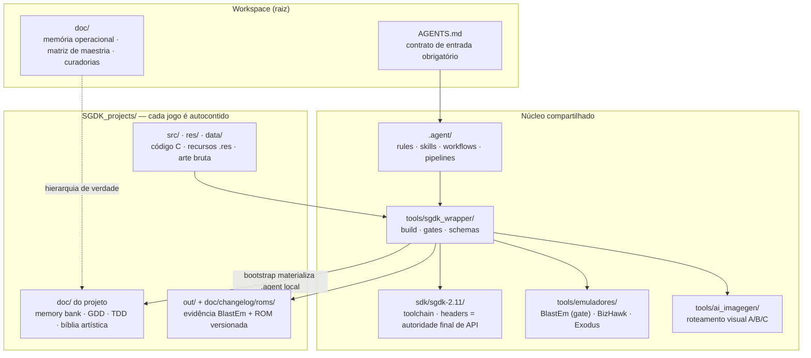
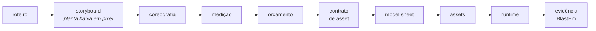
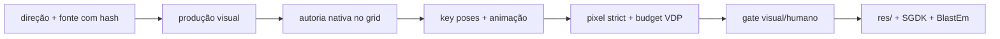
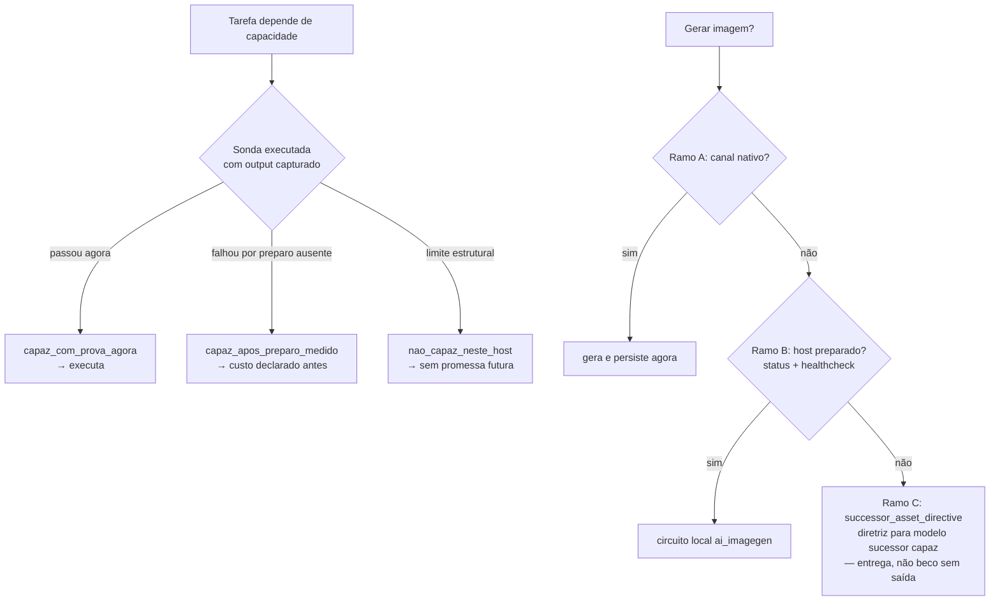

<h1 align="center">SGDK FORGE</h1>

<p align="center">
  <strong>Fábrica metodológica de jogos para Sega Mega Drive / Genesis</strong><br/>
  SGDK 2.11 · agentes de IA disciplinados · ROM real ou nada
</p>

<p align="center">
  
  
  
  
  
  
</p>

> **"Se não foi visto rodando no emulador, não existe."**
> Intenção não é validação. ROM rodando em 60 FPS constantes é.

---

## O que é isto?

Não é um jogo — é a **infraestrutura que produz jogos**. Um workspace onde cada projeto nasce com:

- **Wrapper centralizado de build** (`tools/sgdk_wrapper/`) — fonte única de lógica de build/clean/run
- **Framework `.agent`** — 47 skills, 44 workflows, 3 pipelines machine-readable que padronizam o comportamento de qualquer IA no workspace
- **Gates executáveis** — ~40 auditores que reprova claims não medidos (procedência de arte, budget VDP, evidência de emulador)
- **Doutrina anti-autoengano** — vocabulário de status estrito, hierarquia de verdade documental e capacidade declarada com prova

| Pilar | O que garante |
|---|---|
| **ROM real** | Build via GCC m68k + validação em BlastEm vinculada ao hash do binário |
| **Disciplina de produção** | Orçamento antes da arte; decisão barata erra cedo |
| **Agente honesto** | Nenhum claim sem sonda executada; bloqueio vira entrega (diretriz de sucessor) |

---

## Arquitetura em camadas



**Regra estrutural central:** lógica de build vive *só* no wrapper. Cada projeto contém apenas delegação (`call ..\..\tools\sgdk_wrapper\build.bat`) — zero duplicação.

---

## O ciclo de produção

A ordem canônica inverte o hábito comum: **decisão barata antes de arte cara**. Coreografia e medição custam Python e planilha — quando entram depois da arte pronta, invalidam a arte.



Cada transição passa por um **gate executável** — confiança não é critério:

| Gate | Ferramenta | Reprova |
|---|---|---|
| Build | `sgdk_wrapper/build` (GCC m68k) | erro de compilação |
| Recursos | `validate_resources.ps1` | PNG fora do grid 8×8, sprite acima do limite VDP |
| Procedência | `audit_procedural_asset_provenance.py` | pixel nascido de código como personagem/cenário |
| Scanline | `vdp_scanline_simulator.py` | >20 sprites ou >320 px numa scanline (H40) |
| Contraste | `audit_luma_floor.py` | contraste abaixo de 1 degrau de paleta (34) |
| Evidência | `capture_blastem_evidence` + screenshot semantic gate | captura branca ou sem informação |
| Claims | `audit_promotion_claims.ps1` · claim ceiling | alegar AAA sem escopo aprovado |

### Produção artística: imagem não é asset

O ciclo artístico possui uma separação obrigatória entre direção, produção visual,
autoria nativa, conversão, animação, budget e integração. Uma geração RGB/high-res
pode resolver identidade ou pose e ainda ser apenas `visual_producer_output`;
quantização ou downscale são no máximo `technical_candidate`. Só pixels decididos
no grid alvo podem chegar a `native_candidate`.



O agente trabalha persistentemente em staging, troca de rota quando uma hipótese
falha e consolida decisões humanas. Ele não usa GIMP por ponteiro para tarefas
determinísticas, não promove filtros como arte nativa, não otimiza tiles destruindo
identidade e não transforma validação estrutural em aprovação estética.

Especificação completa: [`doc/03_art/20_canonical_art_production_lifecycle.md`](doc/03_art/20_canonical_art_production_lifecycle.md).

### Gate de entrega — 7 eixos simultâneos

1. build sucesso (`out/rom.bin` existe)
2. validation_report limpo
3. boot em BlastEm (gate obrigatório; BizHawk só complementa telemetria)
4. gameplay básico funcional
5. performance estável a 60 FPS
6. áudio ok
7. memória operacional canônica atualizada

---

## Vocabulário de status (anti-autoengano)

`documentado` ≠ `implementado` ≠ `buildado` ≠ `testado_em_emulador` ≠ `validado_budget`.

| Termo | Significado exato |
|---|---|
| `documentado` | existe apenas em docs |
| `implementado` | código existe, não buildado |
| `buildado` | compila, não testado |
| `testado_em_emulador` | rodou com evidência rastreável (BlastEm fecha o gate) |
| `validado_budget` | VRAM/DMA/sprites confirmados |
| `placeholder` / `parcial` | provisório / incompleto mas funcional |

### Hierarquia de verdade

Quando documentos divergem, vence o de cima:

| # | Fonte | Autoridade |
|---|---|---|
| 1 | `doc/10-memory-bank.md` | estado operacional **real** |
| 2 | `doc/11-gdd.md` | design e escopo |
| 3 | `doc/13-spec-cenas.md` | budget real por cena |
| 4 | `doc/00-diretrizes-agente.md` | regras de processo |
| 5–8 | roteiro, arquitetura, manifestos | apoio |
| 9 | Headers SGDK `sdk/sgdk-2.11/inc/` | API definitiva |
| 10 | Suposição / memória | **última prioridade — nunca especular** |

### Capacidade declarada com prova (§38)

Antes de prometer qualquer coisa (gerar imagem, buildar, rodar), o agente executa uma **sonda real** e declara um de três estados — *"acho que consigo"* não existe:



---

## O que é específico de Mega Drive

Toda a doutrina deriva do hardware real de 1988:

| Restrição física | Doutrina / ferramenta |
|---|---|
| Grid de tile **8×8**; sprites são metasprites | validação de recursos, pixel strict rules |
| **Dois limites por scanline**: H40 = 20 sprites *e* 320 px | `vdp_scanline_simulator.py` — os dois são medidos juntos |
| Paleta **9 bits** (RGB ∈ {0,34,…,238}), ~61 cores úteis | "gradiente suave" não existe — fade = troca de paleta |
| Index 0 sempre transparente | contrato de todo PNG importado |
| BG_A + BG_B + WINDOW (sem terceiro plano) | composição multi-plano |
| Shadow/Highlight (sem alpha blending) | tabela anti-alucinação bloqueia "alpha" |
| DMA só seguro no **VBlank** | orçamento de worst-frame é contrato |
| 68000: `int` = **32 bits** | usar `u16`/`s16`; fix16 em vez de float |
| Z80 dedicado (YM2612 FM + PSG + DAC) | XGM2 como driver padrão; ownership de canal |
| Sem malloc no runtime | buffers estáticos no loop |
| Arte procedural proibida como entrega | auditor de proveniência por símbolo do `.res` |

**Anti-alucinação SGDK:** migração 1.60 → 2.11 embutida (`VDP_setPalette` → `PAL_setPalette(..., DMA)` etc.) — agente é proibido de inventar API; headers são autoridade final.

---

## O que é geral de jogos / engenharia

A espinha dorsal metodológica é transferível para qualquer plataforma (Unity, web, firmware):

- **Hierarquia de verdade documental** — estado operacional > design > processo > suposição
- **GDD × TDD separados** — escopo travado contra feature creep ("se não está no GDD, não entra")
- **Orçamento antes da arte** — análogo ao budget de poligonal/memória em qualquer engine
- **Gates executáveis + CI que reprova claim** — engenharia de software padrão aplicada a assets
- **Design de gameplay formal** — 5 Leis Fundamentais (agência, feedback, fluxo, consistência, recompensa), Golden Path de level design, matriz de IA de inimigos, game feel (hitstop, camera shake)
- **Proveniência de asset** — supply-chain de arte com hash e manifesto
- **Governança de agentes** — skills por domínio, modos de sessão, learning loop com deduplicação, diretriz anti-autoengano

<details>
<summary><strong>Framework .agent em números</strong></summary>

| Domínio | Skills | Exemplos |
|---|---|---|
| art | 14 | `art-translation-to-vdp`, `multi-plane-composition`, `visual-excellence-standards` |
| code | 9 | `sgdk-runtime-coder`, `camera-system-sgdk`, `z80-pcm-custom-driver` |
| planning | 8 | `game-design-planning`, `tdd-authoring`, especializações por gênero (opt-in) |
| governance | 4 | `aaa-pipeline-guardian`, `truth-hierarchy-guard`, `project-learning-loop` |
| operation | 4 | `emulator-vdp-evidence-curator`, `rom-mastering` |
| hardware | 3 | `megadrive-vdp-budget-analyst`, `vram-streaming-dma-queue` |
| design | 3 | `level-design-canonical`, `enemy-design-canonical`, `systems-mechanics-validator` |
| architecture | 2 | `scene-state-architect`, `game-state-transition-architect` |

Mais: **44 workflows**, **3 pipelines machine-readable** (`aaa_scene_v1` tem 14 etapas com gates), **134+ schemas JSON**, matriz de maestria com ~110 técnicas em escada (`mapped → incorporated → reproducible → blastem_proven → senior_default`).

</details>

---

## Início rápido

### Criar novo projeto

```powershell
# Opção 1: via wrapper
.\tools\sgdk_wrapper\new_project.bat

# Opção 2: cópia manual do template
Copy-Item -Recurse .\tools\sgdk_wrapper\modelo .\SGDK_projects\"MEU_PROJETO [VER.001] [SGDK 211] [GEN] [GAME] [ACAO]"
```

Convenção: `NOME [VER.XXX] [SGDK 211] [GENERO] [TIPO]` — ver `doc/PADRAO_NOMENCLATURA.md`.

### Validar ambiente

```powershell
# Preflight do host (Java, make, ImageMagick)
powershell -NoProfile -ExecutionPolicy Bypass -File .\tools\sgdk_wrapper\preflight_host.ps1

# Validação do framework .agent (inclui checagem de paths citados em skills)
python .\tools\sgdk_wrapper\.agent\scripts\validate_skill_framework.py
python .\tools\sgdk_wrapper\.agent\scripts\self_check_agentic_aaa_contracts.py
python .\tools\sgdk_wrapper\.agent\scripts\validate_template_registry.py

# Self-check do toolchain visual (seção 34: ferramenta sem self-check não mede)
python tools/ai_imagegen/imagegen_tool.py self-check

# Contratos de game design
powershell -NoProfile -ExecutionPolicy Bypass -File .\tools\sgdk_wrapper\ci\test_game_design_contract_gates.ps1
```

Pipeline AAA completo: `tools/sgdk_wrapper/.agent/workflows/aaa-scene-pipeline.md` · `tools/sgdk_wrapper/.agent/pipelines/aaa_scene_v1.json`.

<details>
<summary><strong>Estrutura completa do workspace</strong></summary>

```
Sgdk Forge/
├── AGENTS.md                   ← regras canônicas para agentes de IA
├── CLAUDE.md                   ← contexto para Claude
├── README.md                   ← este arquivo
├── .agents/                    ← ponte para skills (symlink relativo)
├── .cursor/rules/              ← regras Cursor (megadrive-sgdk-aaa-pipeline.mdc)
├── doc/
│   ├── 06_AI_MEMORY_BANK.md    ← memória operacional global
│   ├── PADRAO_NOMENCLATURA.md
│   ├── TEMPLATE_REGISTRY.md
│   ├── WORKSPACE_STRUCTURE.md
│   ├── agent_learning/         ← changelogs + learning ledger
│   ├── curation/               ← lições canônicas estruturadas
│   ├── migrations/
│   ├── 05_technical/           ← matriz de maestria hardware-level
│   └── 03_art/
├── sdk/
│   └── sgdk-2.11/              ← toolchain SGDK (~136 MB)
├── SGDK_projects/              ← os jogos (autocontidos, nascem aqui)
├── SGDK_Engines/               ← engines portadas/reutilizáveis
└── tools/
    ├── sgdk_wrapper/           ← wrapper de build + framework .agent
    │   ├── modelo/             ← template herdado por todo projeto novo
    │   ├── schemas/            ← 134+ schemas machine-readable
    │   └── .agent/             ← rules · skills · workflows · pipelines
    ├── ai_imagegen/            ← roteamento visual nativo/API/local (A/B/C)
    ├── emuladores/             ← BlastEm, BizHawk, Exodus, GensKMod
    ├── image-tools/            ← análise/conversão de imagem
    ├── photo2sgdk/             ← conversor foto → SGDK
    └── gen-scripts/            ← scripts auxiliares
```

</details>

<details>
<summary><strong>Notas de migração</strong></summary>

Este root foi populado a partir de `F:\Projects\MegaDrive_DEV` em 2026-06-02. Detalhes em `doc/migration/canonical_copy_report.md`.

- Projetos nascem exclusivamente em `SGDK_projects/`.
- Sem assets soltos nem outputs de build na raiz.
- `tools/ai_imagegen/runtime/` (1.5 GB) e `tools/ai_imagegen/models/` (4 GB) foram **propositalmente excluídos** — reinstalar sob demanda (`imagegen_tool.py install --profile deck_safe_sd15`).

</details>
