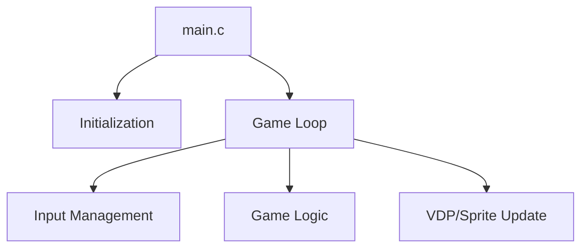

# Engine Architecture Nodes - 7 Star Jam Demo [VER.001] [SGDK 211] [GEN] [ESTUDO] [JAM]

Overview of the technical structure of the 7 Star Jam Demo [VER.001] [SGDK 211] [GEN] [ESTUDO] [JAM] engine.

## 1. Modular Structure
The engine is composed of the following core modules:
- **`main.c`**: Entry point and primary game loop.
- **`afterDay.c`**: Module file.
- **`day.c`**: Module file.
- **`draw_sjis.c`**: Module file.
- **`game.c`**: Module file.
- **`gameClear.c`**: Module file.
- **`gameOver.c`**: Module file.
- **`howToPlay.c`**: Module file.
- **`init.c`**: Module file.
- **`logo.c`**: Module file.
- **`title.c`**: Module file.
- **`tools.c`**: Module file.
- **`work.c`**: Module file.

## 2. Key Technical Nodes
### Game Loop
The heart of the engine is a `while(1)` loop in `main.c` that synchronizes with the VBlank.

### Core Systems
- **VDP Management**: Handles plane scrolling and tile loading.
- **Sprite Engine**: Enabled and active for entity management.
- **Resource Management**: Loads tilesets and palettes from `res/`.

## 3. Data Flow

## 4. Primary Functions
Some of the key identified functions in this engine include:
for, main, while, switch
