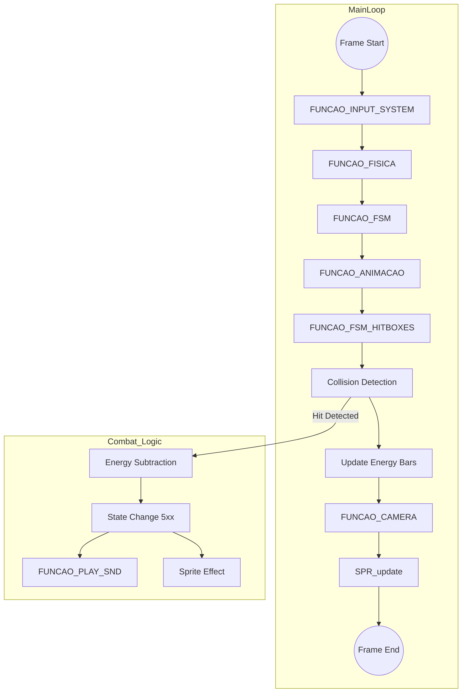

# Engine Architecture Nodes - BLAZE_ENGINE

This document outlines the technical architecture of the BLAZE_ENGINE, mapping the internal nodes, core functions, and data flow.

## 1. Core Structural Nodes

### Character Data (PlayerDEF / EnemyDEF)
*   **Purpose**: Stores all attributes for active entities.
*   **Key Fields**: `x, y` (position), `ground` (shadow/floor Y), `state` (FSM ID), `energy`, `dataHBox` (Attack), `dataBBox` (Hurt).

### Input System (`FUNCAO_INPUT_SYSTEM`)
*   **Nature**: Polling-based joypad reader.
*   **Logic**: Translates raw buttons into specific behaviors (Pressed, Hold, Released) and provides a `key_JOY_countdown` array for double-tap detection (Sprinting).

### State Machine Manager (`FUNCAO_FSM`)
*   **Nature**: Conditional Logic Controller.
*   **Logic**: The "Brain" of the engine. Evaluates inputs + current state + physics flags to decide the next state.
*   **Example**: If `state == 100` AND `JOY_RIGHT_Pressed`, set `state = 420`.

### Physics Engine (`FUNCAO_FISICA`)
*   **Nature**: Procedural Position Updater.
*   **Calculations**:
    *   **Gravity**: Updates `impulsoY` linearly during jumps.
    *   **Boundary Control**: Hardcoded horizontal limits (`margin`) and vertical wall (`invisibleWallY`).
    *   **Parallax Support**: Notifies `FUNCAO_CAMERA` for scrolling updates.

### Animation System (`FUNCAO_ANIMACAO`)
*   **Nature**: Frame & Hitbox synchronization.
*   **Logic**: Increments `frameTimeAtual`. When it exceeds `frameTimeTotal`, it calls `FUNCAO_FSM_HITBOXES(i)` to update rects for the new frame.

## 2. Technical Flowchart

## 3. Database Functions

| Function Name | Responsibility |
| :--- | :--- |
| `CREATE_ENEMY` | Allocates a slot in the `E` array and initializes sprite/stats. |
| `PLAYER_STATE` | Resets timers and updates the `dataAnim` pointer for a specific player state. |
| `ENEMY_STATE` | Equivalent for enemy entities. |
| `FUNCAO_COLISAO`| Standard AABB intersection: `(R1.x < R2.x + R2.w) && (R1.x + R1.w > R2.x) ...` |
| `FUNCAO_CTRL_SLOTS_BGS` | Dynamic VDP Tile loading based on `camPosX`. Loads stage segments from ROM to VRAM on the fly. |

## 4. Key Global Flags

*   **`room`**: Context switcher (0: Credits, 1: Menu, 2: Select, 3: InGame).
*   **`segmentLimiter`**: Prevents players from scrolling back too far or moving forward before defeating enemies.
*   **`ATTACK_MARGIN`**: Defines the depth tolerance (pseudo-3D plane) for attacks to connect.
