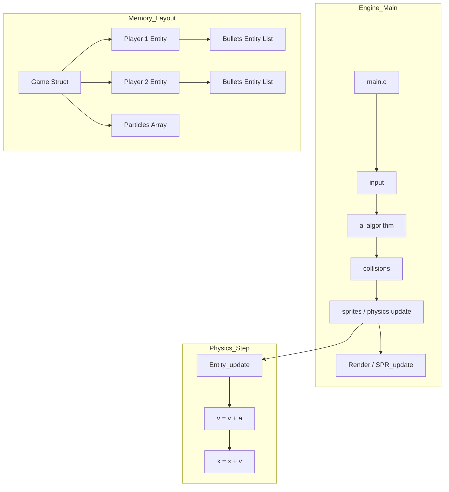

# Engine Architecture Nodes - FireBrawl

This document outlines the technical architecture of the FireBrawl engine, focusing on its pseudo-Object Oriented C structure and physics-based entity system.

## 1. Structural Nodes (Entity Component System)

FireBrawl implements a lightweight **Entity-Component** pattern for all gameplay elements:

*   **`Entity` Node**: The base unit for sprites, particles, and projectiles.
    *   **Fields**: `x, y` (position), `dx, dy` (velocity), `ddx, ddy` (acceleration), `ttl` (Time-To-Live for temporary objects).
    *   **Management**: Handled via `Entity_new` (constructor) and `Entity_del` (destructor) using dynamic memory allocation (`malloc`/`free`).

*   **`Player` Node**: An extension of the Entity, managing player-specific state.
    *   **Fields**: `bullets[]` (projectile list), `health_notches[]` (HUD sprites), `cooldowns` (B/C buttons).
    *   **AI Support**: Includes `ai_state` (Attack/Defend) and `ai_state_frames`.

## 2. Core Systems

### Vector Physics Manager (`Entity_update`)
*   **Logic**: A standard Eulerian integration: `velocity += acceleration; position += velocity;`.
*   **Usage**: Applied to players, bullets, and particles every frame, creating smooth parabolic jumps and projectile arcs.

### Circular Collision Node (`Entity_collide`)
*   **Math**: `dx*dx + dy*dy <= COLLISION_THRESH`
*   **Advantage**: Much simpler to calculate and more accurate for projectiles/particles than standard AABB (rectangular) checks.

### Predictive AI Node (`ai`)
*   **Function**: `will_collide`
*   **Logic**: Simulates future entity positions over 32 frames to determine if an incoming projectile represents a threat. If so, it triggers defensive jumps or counter-fire.

## 3. Data Flow Diagram

## 4. Resource Allocation

*   **VRAM Management**: High-frequency sprite updates for particles (`MAX_PARTICLES`) using transient entities.
*   **Audio**: Uses `XGM_startPlayPCM` for digital SFX (fireball, jump, damage).
*   **Palettes**:
    *   `PAL0`: Background.
    *   `PAL1/PAL2`: Players 1 and 2.
    *   `PAL3`: UI (Notches) and Fireballs.
