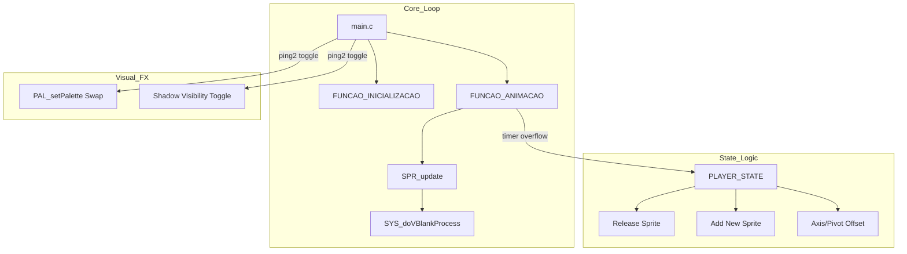

# Engine Architecture Nodes - HAMOOPIG (Ver. 001)

This documentation details the minimalist technical architecture of the HAMOOPIG Ver. 001 prototype, emphasizing manual VRAM management and visual synchronization.

## 1. Core Data Structures

### `PlayerDEF` Struct
The heart of the engine. It encapsulates all state and animation data to allow for multi-character logic without duplicating code.

*   **Sprite Nodes**: `sprite` (VDP sprite) and `sombra` (hardware shadow sprite).
*   **State Node**: `state` ID mapping to character-specific frame data.
*   **Animation Array**: `dataAnim[60]`. Each index represents an animation frame, and its value is the duration (in screen frames) for that frame.

## 2. Functional Architecture

### State Transition Node (`PLAYER_STATE`)
*   **Destructor/Constructor Pattern**: When a state changes, the current sprite is released (`SPR_releaseSprite`) and a new one is allocated from VRAM.
*   **Safe Allocation**: Uses `SPR_addSpriteExSafe` with auto-VRAM and auto-Tile upload flags to prevent VRAM memory leaks.
*   **Depth Assignment**: Manually manages layering (`SPR_setDepth`) to ensure consistent ordering on the Mega Drive's hardware planes.

### Manual Animation Sequencer (`FUNCAO_ANIMACAO`)
*   **Logic**: A simple timer-based comparison loop.
*   **Independence**: Since it doesn't rely on SGDK's internal animation speed, the developer can implement variable frame timing (e.g., Frame 1 = 10ms, Frame 2 = 60ms) which is essential for accurate fighting game feel.

## 3. Technical Flowchart

## 4. Hardware Palette Management

The engine uses a dynamic palette swapping technique:
*   **A/B Palettes**: Every character has two palette data sets (e.g., `haohmaru_pal1` and `pal1b`).
*   **Frame-rate Sync**: By swapping these palettes every frame using `VDP_setPalette`, the engine achieves a shimmering/glowing effect that would otherwise require complex sprite overlay techniques.
