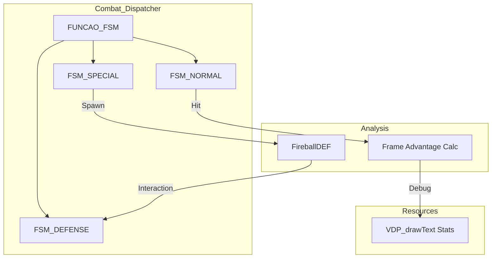

# Engine Architecture Nodes - KOF94 HAMOOPIG MINIMALIST

This documentation details the advanced technical architecture of the KOF94 variant of the HAMOOPIG engine, which features significant modularity and competitive fighting game tools.

## 1. Modular FSM Dispatcher Node (`main.c`)

The core combat logic is decoupled into specialized function nodes, improving both readability and technical precision:

*   **`FUNCAO_FSM_NORMAL_ATTACKS`**: Standalone node for processing non-projectile hitboxes and animation timing for basic strikes.
*   **`FUNCAO_FSM_SPECIAL_ATTACKS`**: Manages the logic for motion-buffered special moves, including projectile spawns and multi-frame hitboxes.
*   **`FUNCAO_FSM_DEFENSE`**: A comprehensive node for guarding mechanics, implementing high/low blocking logic based on `guardFlag`.

## 2. Competitive Analysis Node (`frameAdvCounter`)

The engine provides a built-in frame data analysis system:
*   **Advantage Calculation**: Every attack animation increments a `frameAdvCounter`.
*   **Hit/Block Stun Check**: By comparing the attacker's recovery frames against the defender's stun frames, the engine calculates "Frame Advantage" in real-time.
*   **Utility**: This allows for precise tuning of "safe" and "unsafe" moves directly in the engine's source.

## 3. High-Fidelity Projectile Node (`FireballDEF`)

Projectiles are no longer treated as simple sprites but as full entity structs:
*   **`FireballDEF` Struct**: Contains independent hitbox data (`dataHBox`), `guardFlag`, and `countDown` for reliable destruction and interaction with the FSM.
*   **Screen-Space Logic**: Manages horizontal and vertical propagation independently of the player character's current state.

## 4. Game Cycle Node (`stepRoom`)

The engine's room management uses a sub-state system called `stepRoom`:
*   **Step 1**: Initialization and VDP setup.
*   **Step 2**: Logic updates and input processing.
*   **Step 3**: Clean-up and transition triggers.
*   **Usage**: Prevents race conditions during heavy resource loading (like character switching).

## 5. Architecture Overview

