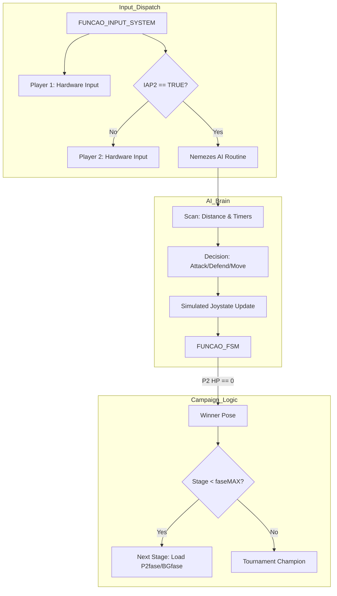

# Engine Architecture Nodes - HAMOOPIG (Ver. 1.0 CPU 6.2 [Nemezes Edition])

This documentation details the technical architecture of the "Nemezes Edition" variant of the HAMOOPIG engine, which introduces automated decision-making and campaign-specific logic.

## 1. Automated Decision Node (`main.c`)

The engine's AI is implemented as a procedurally driven decision tree within the combat loop (`Room 10`).

*   **Scan Node**: Every frame, the AI checks player positions. If `IAP2 == TRUE`, the standard Joypad input logic for P2 is bypassed by the AI's state-machine.
*   **Timer-Driven Logic**: The AI doesn't react instantly; it uses `tempoIA` to simulate human reaction delay and `tempoIAataque` to time its offensive bursts based on defined stage difficulty.

## 2. Tournament Campaign Management

The campaign is managed via a set of static arrays that drive the `Room` transitions:
*   **Opponent Table (`P2fase`)**: Determines the character ID for the CPU opponent.
*   **Background Table (`BGfase`)**: Determines the VDP image to be loaded into the scroll planes.
*   **Difficulty Table (`defesaIA`)**: Injects per-stage thresholds into the AI's blocking logic.

## 3. Technical Flowchart (AI Logic)

## 4. Enhanced System Parameters

*   **`faseMAX`**: Configurable constant that determines the total number of fights in the tournament (up to 8).
*   **`abs(P[1].x-P[2].x) < 150`**: The "Danger Zone" threshold where the AI prioritizes defensive states or close-range combos.
*   **`tempoIAmagia`**: A cooldown timer specifically for projectiles to prevent the AI from spamming fireballs (ensuring fair gameplay).
*   **`spr_color_cursor`**: New UI node used in the selection screen to determine the character color swap, integrated with the palette management of earlier 1.0 builds.
