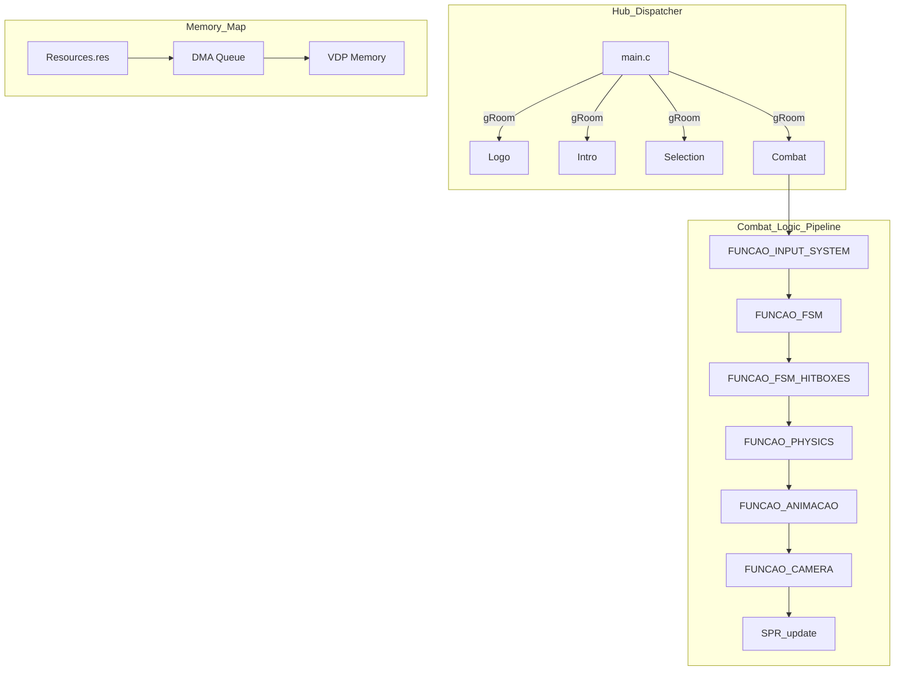

# Engine Architecture Nodes - HAMOOPIG (Ver. 1.0)

This document details the high-fidelity technical architecture of the HAMOOPIG Ver. 1.0 engine, a production-level fighting game framework for the Sega Mega Drive.

## 1. Multi-Stage Dispatcher Node (`main.c`)

The engine operates as a state machine of game "Rooms" (`gRoom`). Transitioning between these rooms involves a complete VDP reset, palette update, and VRAM memory re-alignment.

*   **Initialization Sequence**: Every room begins with a `gFrames==1` check, loading the necessary `BG_A`, `BG_B`, and Sprites from the resource pool.
*   **Descompression Node (Room 9)**: A specialized transition state that ensures the VDP is clear before loading heavy 128x128 combat sprites, preventing visual glitches.

## 2. Fighting Core Nodes (Room 10)

The combat logic is split into several interconnected procedures:

### Physics & Movement Node (`FUNCAO_PHYSICS`)
*   **Vector Calculus**: Uses `impulsoY` and `gravidadeY` for jumping arcs.
*   **Boundary Control**: Enforces `gLimiteCenarioE` and `gLimiteCenarioD`, and prevents players from passing through each other (`BODYSPACE`).

### State and Data Node (`PLAYER_STATE`)
*   **Data-Inlining**: Character-specific data (frame counts, pivots, hitbox relative offsets) is hardcoded within this function, prioritizing execution speed over modularity.
*   **Sprite Management**: Efficiently handles up to 80 sprites per frame, utilizing SGDK's `SPR_addSpriteExSafe` for automatic VRAM slot allocation.

### Input Scrutiny Node (`FUNCAO_INPUT_SYSTEM`)
*   **Buffer Logic**: Detects complex button sequences (Magias/Specials) by checking `inputArray` against a timestamped buffer.
*   **Sensitivity**: Tracks "Just Pressed" and "Hold" states for all 6 buttons (A, B, C, X, Y, Z).

## 3. Technical Flowchart

## 4. Proprietary Systems

*   **A.S.G.S (Anti Sprite Glitch System)**: A custom routine (`gASG_system`) that manages sprite flickering to bypass the hardware limits of the Mega Drive (maximum of 20 sprites per scanline).
*   **Spark System**: A pool-based system (`Spark[3]`) to manage combat effects like sparks, blood, and projectile impacts without impacting the main player sprite pool.
*   **Dynamic Backgrounds**: `FUNCAO_CAMERA_BGANIM` synchronizes background layer movement with foreground action, including parallax scrolling.
