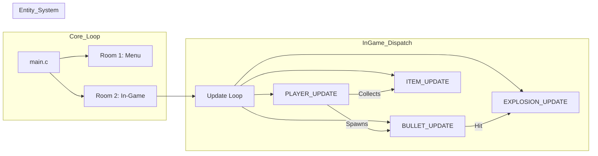

# Engine Architecture Nodes - Jogo de Nave (SHMUP Engine)

This documentation details the technical architecture of the `Jogo de Nave` SHMUP engine, highlighting its flexible projectile and object pooling systems.

## 1. Multi-Weapon Projectile Node (`BulletDEF`)

The engine implements a unified `BulletDEF` struct for all player-fired projectiles.
*   **State Management**: `Bullet[i].state` determines the lifecycle of the bullet. `state = 9` triggers a destruction animation with a `ctrlTimer`.
*   **Directional Routing**: `Bullet[i].dir` uses a numeric keypad mapping (1-9) to determine horizontal and vertical velocity.
*   **Type Specialization**: The engine handles `RED`, `BLUE`, and `SUPER` bullets through specialized `INIT/UPDATE` functions that modify the base `BulletDEF` attributes.

## 2. HUD Synchronization Node (`HudDEF`)

The engine separates combat data from visual feedback via the `HudDEF` structure.
*   **Dynamic Animation Linking**: Items like `spr_super_bar` and `spr_speed_bar` use their current variable value (e.g., `P[i].super_bar`) directly as the sprite animation index (`SPR_setAnim`). This ensures zero-latency visual feedback for player status.

## 3. High-Performance Scroller Node (`VDP_setHorizontalScroll`)

The engine implements a seamless parallax background system:
*   **Infinite Scrolling**: Uses `gFrames` as a continuous offset for the BG_B plane (`VDP_setHorizontalScroll(BG_B, gFrames * -1)`).
*   **Loop Reset**: Handled by the VDP hardware as the scroll value wraps around the 512x256 (or 1024x512) plane size.

## 4. Item Distribution Node (`ItemBoxDEF`)

A separate management system for loot drops:
*   **Spawn Logic**: `ITEM_BOX_INIT` creates a placeholder in the world that can move and eventually "pop" into a wearable `ItemDEF`.
*   **Loot Probability**: Defined by `type = 9` (Random) or fixed types (Speed, Life, Red, Blue).

## 5. Composition Diagram

