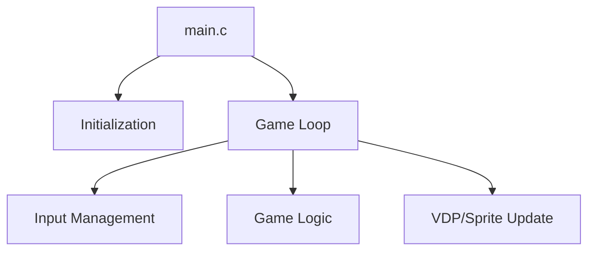

# Engine Architecture Nodes - Masiaka Demo [VER.001] [SGDK 211] [GEN] [ESTUDO] [DEMO]

Overview of the technical structure of the Masiaka Demo [VER.001] [SGDK 211] [GEN] [ESTUDO] [DEMO] engine.

## 1. Modular Structure
The engine is composed of the following core modules:
- **`main.c`**: Entry point and primary game loop.
- **`ankou_screen.c`**: Module file.
- **`ball_coords.c`**: Module file.
- **`barb_picture.c`**: Module file.
- **`barb_title_screen.c`**: Module file.
- **`cube_fx.c`**: Module file.
- **`db.c`**: Module file.
- **`demo_strings.c`**: Module file.
- **`div_premul.c`**: Module file.
- **`easing_table.c`**: Module file.
- **`easing_table_fp.c`**: Module file.
- **`fb.c`**: Module file.
- **`firefx.c`**: Module file.
- **`fire_fx_screen.c`**: Module file.
- **`flames_wave.c`**: Module file.
- **`glenz_fx.c`**: Module file.
- **`logos_vertices.c`**: Module file.
- **`logo_meshs.c`**: Module file.
- **`logo_yscroll_table.c`**: Module file.
- **`main_logo.c`**: Module file.
- **`music.c`**: Module file.
- **`owl_screen.c`**: Module file.
- **`page_writer.c`**: Module file.
- **`quicksort.c`**: Module file.
- **`raytrace_screen.c`**: Module file.
- **`rotozoomfx.c`**: Module file.
- **`roto_screen.c`**: Module file.
- **`scroll_h_table.c`**: Module file.
- **`scroll_v_table.c`**: Module file.
- **`shield_anim.c`**: Module file.
- **`sine_scroll.c`**: Module file.
- **`starfield_fx.c`**: Module file.
- **`string_parser.c`**: Module file.
- **`transition_helper.c`**: Module file.
- **`twister_jump_table.c`**: Module file.
- **`vector_balls.c`**: Module file.
- **`writer.c`**: Module file.

## 2. Key Technical Nodes
### Game Loop
The heart of the engine is a `while(1)` loop in `main.c` that synchronizes with the VBlank.

### Core Systems
- **VDP Management**: Handles plane scrolling and tile loading.
- **Sprite Engine**: Not explicitly using the SGDK Sprite Engine in a visible way.
- **Resource Management**: Loads tilesets and palettes from `res/`.

## 3. Data Flow

## 4. Primary Functions
Some of the key identified functions in this engine include:
main, while, wait_until_time
