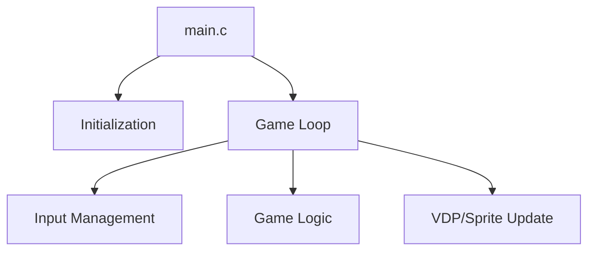

# Engine Architecture Nodes - Mega Metroid [VER.001] [SGDK 211] [GEN] [GAME] [PLATAFORMA]

Overview of the technical structure of the Mega Metroid [VER.001] [SGDK 211] [GEN] [GAME] [PLATAFORMA] engine.

## 1. Modular Structure
The engine is composed of the following core modules:
- **`main.c`**: Entry point and primary game loop.
- **`entity.c`**: Module file.
- **`map.c`**: Module file.
- **`map_crateria_1.c`**: Module file.
- **`map_crateria_2.c`**: Module file.
- **`physics.c`**: Module file.
- **`types.c`**: Module file.

## 2. Key Technical Nodes
### Game Loop
The heart of the engine is a `while(1)` loop in `main.c` that synchronizes with the VBlank.

### Core Systems
- **VDP Management**: Handles plane scrolling and tile loading.
- **Sprite Engine**: Enabled and active for entity management.
- **Resource Management**: Loads tilesets and palettes from `res/`.

## 3. Data Flow

## 4. Primary Functions
Some of the key identified functions in this engine include:
stopSoundJump, while, playerApplyGravity, boot, checkTileCollisions, updateCamera, playSoundJump, if, playerUpdate, playerUpdateAnimation
