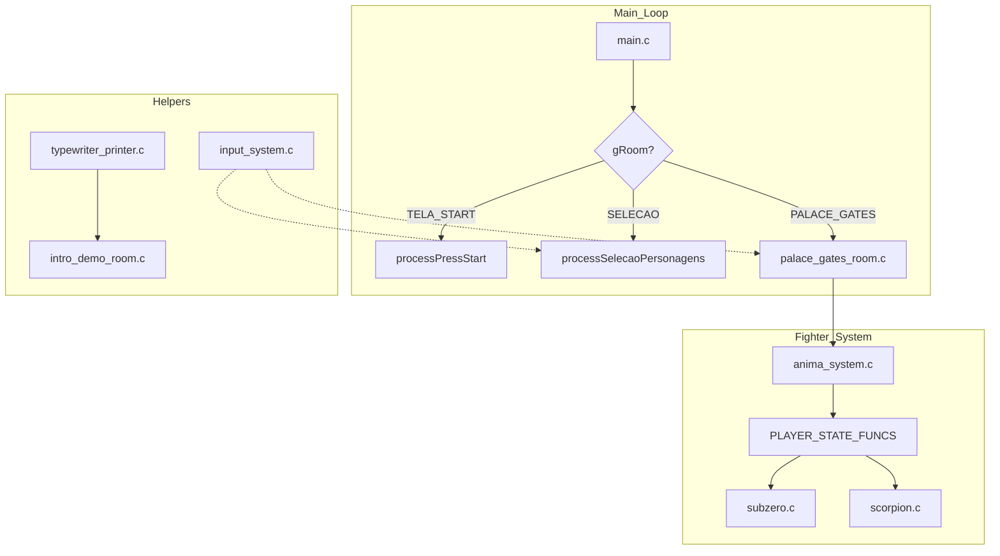

# Engine Architecture Nodes - Mortal Kombat Plus

This documentation details the technical design of the Mortal Kombat Plus engine, highlighting its modular architecture and data-driven approach.

## 1. Modular Hierarchy

The engine is structured as a tree of specialized modules, moving away from a monolithic `main.c`:

*   **`main.c`**: High-level Room Switcher and Game Loop.
*   **`src/rooms/`**: Contains the logic for specific game states (Intro, Select, Palace Gates).
*   **`src/fighters/`**: Character-specific definitions. Each file (e.g., `subzero.c`) acts as a "factory" for character state data.
*   **`src/modulos/`**: Sub-systems like Input, Animation, and Text Printers.

## 2. Core Technical Nodes

### Sequential Animation Node (`anima_system.c`)
*   **Function**: `anima()`
*   **Role**: A global sequencer that iterates through `player[0]` and `player[1]`. It uses `frameTimeTotal` from each character's current animation data to control frame pacing.
*   **Dispatch**: Calls character-specific functions through a function pointer array (`PLAYER_STATE_FUNCS`).

### Input abstraction Node (`input_system.c`)
*   **Function**: `inputSystem()`
*   **Role**: Decouples hardware `JOY_read` from gameplay logic. It translates bitwise joypad states into a 4-state lifecycle (0:Off, 1:Pressed, 2:Hold, 3:Released).

### Room State Controller
Controlled by `gRoom` (Global Room Variable):
*   Logic is encapsulated in functions like `processIntro()`, which contain their own internal `while(true)` loops for specific screen sequences.

## 3. Data Flow Diagram

## 4. Key Structures (`estruturas.h`)

*   **`Player`**: Encapsulates position, velocity, current state, and pointers to current animation frames.
*   **`GraphicElement` (GE)**: A generic slot-based system for managing non-player sprites (cursors, backgrounds, messages), preventing VRAM fragmentation by reusing slots.
*   **`BioData`**: Stores biographical text, voices (PCM), and specific portraits for the character intro sequences.
