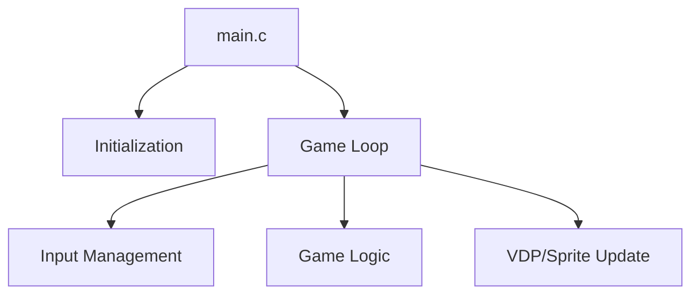

# Engine Architecture Nodes - NEXZR MD [VER.001] [SGDK 211] [GEN] [GAME] [SHMUP]

Overview of the technical structure of the NEXZR MD [VER.001] [SGDK 211] [GEN] [GAME] [SHMUP] engine.

## 1. Modular Structure
The engine is composed of the following core modules:
- **`main.c`**: Entry point and primary game loop.
- **`background.c`**: Module file.
- **`characters.c`**: Module file.
- **`enemies.c`**: Module file.
- **`entitymanager.c`**: Module file.
- **`game.c`**: Module file.
- **`hud.c`**: Module file.
- **`i18n.c`**: Module file.
- **`intro.c`**: Module file.
- **`level_1.c`**: Module file.
- **`menu.c`**: Module file.
- **`player.c`**: Module file.
- **`utils.c`**: Module file.

## 2. Key Technical Nodes
### Game Loop
The heart of the engine is a `while(1)` loop in `main.c` that synchronizes with the VBlank.

### Core Systems
- **VDP Management**: Handles plane scrolling and tile loading.
- **Sprite Engine**: Not explicitly using the SGDK Sprite Engine in a visible way.
- **Resource Management**: Loads tilesets and palettes from `res/`.

## 3. Data Flow

## 4. Primary Functions
Some of the key identified functions in this engine include:
main
