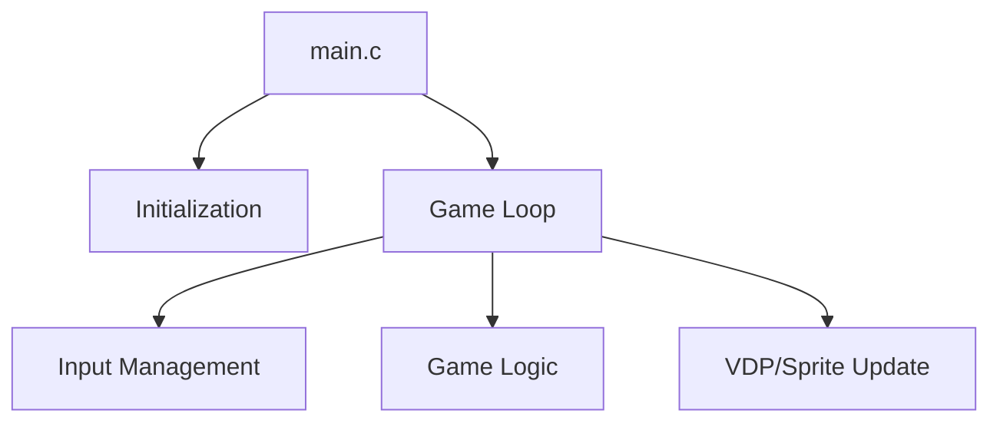

# Engine Architecture Nodes - Raycasting Anael [VER.001] [SGDK 211] [GEN] [ESTUDO] [3D]

Overview of the technical structure of the Raycasting Anael [VER.001] [SGDK 211] [GEN] [ESTUDO] [3D] engine.

## 1. Modular Structure
The engine is composed of the following core modules:
- **`main.c`**: Entry point and primary game loop.
- **`frame_buffer.c`**: Module file.
- **`frame_buffer_halved.c`**: Module file.
- **`game_loop.c`**: Module file.
- **`hint_callback.c`**: Module file.
- **`hud.c`**: Module file.
- **`joy_6btn.c`**: Module file.
- **`map_hit_compressed.c`**: Module file.
- **`map_matrix.c`**: Module file.
- **`perf_hash_mulu_256_shft_FS.c`**: Module file.
- **`render.c`**: Module file.
- **`rom_header.c`**: Module file.
- **`spr_eng_override.c`**: Module file.
- **`teddyBearLogo.c`**: Module file.
- **`title_vscroll_2_planes.c`**: Module file.
- **`utils.c`**: Module file.
- **`vint_callback.c`**: Module file.
- **`weapon.c`**: Module file.

## 2. Key Technical Nodes
### Game Loop
The heart of the engine is a `while(1)` loop in `main.c` that synchronizes with the VBlank.

### Core Systems
- **VDP Management**: Handles plane scrolling and tile loading.
- **Sprite Engine**: Enabled and active for entity management.
- **Resource Management**: Loads tilesets and palettes from `res/`.

## 3. Data Flow

## 4. Primary Functions
Some of the key identified functions in this engine include:
if, main, checkConstantsCorrectValues
