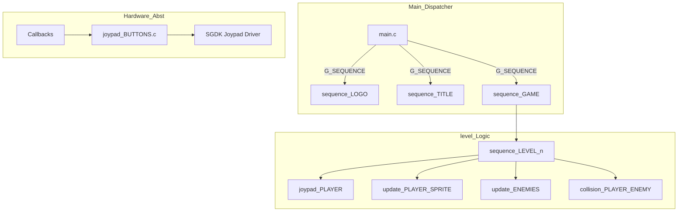

# Engine Architecture Nodes - Vigilante Tutorial

This document details the technical architecture of the Vigilante Tutorial engine, which emphasizes event-driven inputs and a massive procedure-oriented logic structure.

## 1. Sequence Manager Node (`main.c`)

The high-level execution is controlled by `G_SEQUENCE` within a dispatcher loop. Every screen transition resets `G_SEQUENCE_LOADED`, triggering a new initialization phase.

*   **Sequences**: `LOGO`, `TITLE`, `RANKING`, `INTERMEDE`, `GAME`.
*   **Encapsulation**: Each sequence switch swaps the Sprite list, Palettes, and VRAM layout.

## 2. Core Functional Nodes

### Event-Driven Input Handler (`joypad_BUTTONS.c`)
*   **Nature**: Callback-based. Uses `JOY_setEventHandler`.
*   **Logic**: Instead of a global polling function, the engine registers a specific handler for the current game context (e.g., `player_Callback` during levels). This reduces branching logic inside the input system.

### Procedural Gameplay Sequencer (`routines_LEVEL.c`)
*   **Nature**: Monolithic Procedure Manager.
*   **Logic**: A 9000+ line file that contains specific logic for every level (`sequence_LEVEL_1` to `sequence_LEVEL_5`). It handles:
    *   **Manual Animation Manager**: Uses `counter_ANIM_SPRITE` and `SPR_setFrame` instead of SGDK's automatic animations, allowing for frame-perfect weapon synchronization.
    *   **Multi-Plane Scrolling**: Manages `BG_A` and `BG_B` with different offsets (`G_POS_X_CAMERA / 3` for parallax).

### Collision Detection Node
*   **Nature**: Range-based AABB variants.
*   **Functions**: `collision_PLAYER_ENEMY_RIGHT` and `collision_PLAYER_ENEMY_LEFT`.
*   **Logic**: Checks for `pos_Y` equality first (z-depth plane matching) and then scans the `LIST_ENEMIES` array for X-axis overlaps within fixed weapon-reach bounds.

## 3. Technical Flowchart

## 4. Global Variables & Tables

*   **`G_GRAVITY`**: Fixed-point accumulator for jumping physics.
*   **`TABLE_SCROLLING_ROUTINE`**: An array of function pointers that directs scrolling logic based on the current level ID.
*   **`LIST_ENEMIES`**: A static array tracking up to 4 active enemies on screen at any time.
