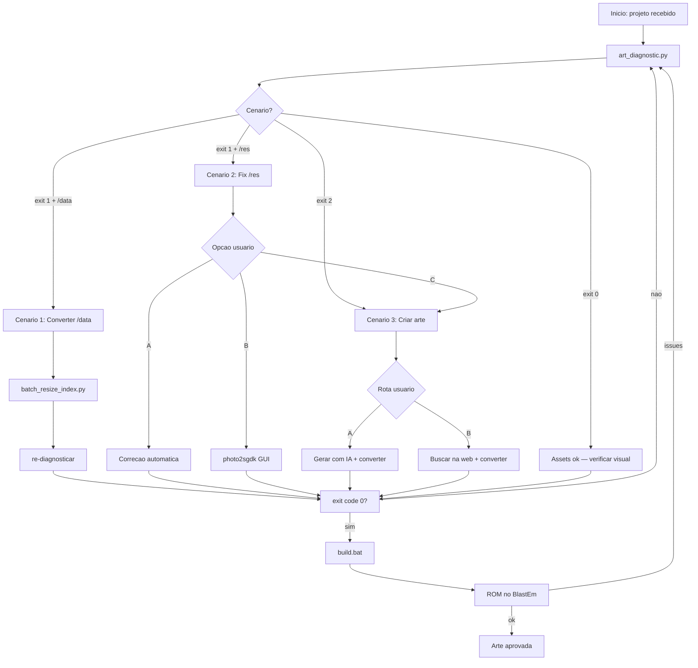

# Workflow: Art Onboarding — 3 Cenarios

Use este workflow quando iniciar qualquer trabalho de arte em um projeto SGDK, ou quando receber um projeto com estado de arte desconhecido.

**Agente responsavel:** `art-pipeline-operator` (coordena), `art-creator` (cenario 3)

---

## Passo 0 — Diagnostico inicial (SEMPRE)

```bash
python tools/sgdk_wrapper/art_diagnostic.py \
  --project "<caminho_do_projeto>" \
  --output doc/art_diagnostic.json
```

Interpretar resultado e ir para o cenario correspondente.

---

## CENARIO 1 — `/data` existe, precisa conversao

**Detectado quando:** exit code 1 + diretorio `/data` com PNGs + issues `NOT_INDEXED` ou `DIM_NOT_MULTIPLE_8`

### Fluxo

```
1. Revisar relatorio de issues em doc/art_diagnostic.json
2. Criar spec JSON (se nao existir):
   tools/image-tools/specs/<projeto>_spec.json

3. Pre-processamento:
   python tools/image-tools/fix_png_transparency_final.py "<projeto>/data"

4. Conversao em lote:
   python tools/image-tools/batch_resize_index.py \
     --spec tools/image-tools/specs/<projeto>_spec.json \
     --batch-root "<projeto>/data"

5. OU conversao via GUI (para assets criticos):
   call tools\photo2sgdk\run.bat

6. Re-diagnosticar para confirmar:
   python tools/sgdk_wrapper/art_diagnostic.py --project "<projeto>"
   # Esperado: exit code 0

7. Validar com SGDK:
   powershell -File tools\sgdk_wrapper\validate_resources.ps1

8. Build de teste:
   call build.bat

9. Verificar ROM no emulador (BlastEm obrigatorio):
   call run.bat
```

### Criterio de saida do Cenario 1

```
✅ art_diagnostic.py exit code = 0
✅ validate_resources.ps1 sem erros
✅ Todos os PNGs em modo P (indexado)
✅ Dimensoes multiplas de 8
✅ Max 15 cores por paleta
✅ build.bat sucesso
✅ ROM abre sem artefatos visuais
```

---

## CENARIO 2 — `/res` existe, assets inadequados

**Detectado quando:** exit code 1 + assets em `/res` com issues criticos ou de qualidade

### Fluxo

```
1. Gerar relatorio detalhado por asset
2. Classificar issues:
   - CRITICOS (NOT_INDEXED, DIM_NOT_MULTIPLE_8, TOO_MANY_COLORS): bloqueantes
   - AVISOS (COLORS_NOT_9BIT, NO_MAGENTA_TRANSPARENT): degradam qualidade

3. Apresentar 3 opcoes ao usuario:
```

**Opcao A — Correcao automatica:**
```bash
# Corrigir transparencia automaticamente
python tools/image-tools/fix_png_transparency_final.py "<projeto>/res"

# Auto-fix sprite.res
powershell -File tools\sgdk_wrapper\autofix_sprite_res.ps1

# Validar
python tools/sgdk_wrapper/art_diagnostic.py --project "<projeto>"
```

**Opcao B — Reconversao manual via photo2sgdk:**
```bash
# Abrir GUI para ajuste preciso
call tools\photo2sgdk\run.bat
# Para cada asset com issue critico:
# 1. Carregar o PNG
# 2. Ajustar paleta para <= 15 cores no grid 9-bits
# 3. Exportar indexado para res/
```

**Opcao C — Substituir por novos assets:**
```bash
# Ir para Cenario 3 para criar/buscar novos assets
# (manter backup dos originais em data/raw/)
```

```
4. Executar opcao escolhida pelo usuario
5. Re-diagnosticar e validar
6. Build de teste + ROM no emulador
```

### Criterio de saida do Cenario 2

```
✅ Todos os issues criticos resolvidos
✅ art_diagnostic.py exit code = 0
✅ Usuario notificado sobre avisos restantes (se houver)
✅ Build e ROM funcionais
```

---

## CENARIO 3 — Sem arte

**Detectado quando:** exit code 2 (nenhum asset encontrado)

### Fluxo

```
1. Definir bible artistica resumida
2. Listar assets necessarios com dimensoes
3. Apresentar analise de rotas A e B ao usuario
4. Aguardar decisao do usuario
```

### ROTA A — Geracao com IA

```
5A. Gerar prompts especializados por asset
6A. Gerar imagens (ferramenta de IA escolhida)
7A. Salvar em data/production/
8A. Executar conversao (igual ao Cenario 1)
9A. Validar e ajustar ate exit code 0
10A. Build de teste + ROM
```

### ROTA B — Busca na Web

```
5B. Buscar em opengameart.org, itch.io com queries especializadas
6B. Avaliar cada asset (licenca, dimensoes, estilo, cores)
7B. Baixar selecionados para data/raw/
8B. Documentar licencas em data/ASSETS_CREDITS.md
9B. Cortar sprite sheets se necessario (ImageMagick)
10B. Executar conversao (igual ao Cenario 1)
11B. Validar e ajustar ate exit code 0
12B. Build de teste + ROM
```

### Criterio de saida do Cenario 3

```
✅ Bible artistica documentada
✅ Creditos de assets documentados (se Rota B)
✅ Spec JSON criado para todos os assets
✅ art_diagnostic.py exit code = 0
✅ Build e ROM funcionais
✅ Assets aprovados visualmente pelo usuario
```

---

## Diagrama resumido



---

## Handoff de sessao (arte)

Ao encerrar sessao de trabalho de arte:

1. Atualizar `doc/art_diagnostic.json` com ultimo estado
2. Registrar quais assets estao `convertido`, `aguarda_aprovacao` ou `pendente`
3. Documentar decisoes de paleta (por que determinada cor foi escolhida)
4. Se usou Rota B, verificar que ASSETS_CREDITS.md esta completo
5. Se build falhou, registrar o erro exato e o asset causador
