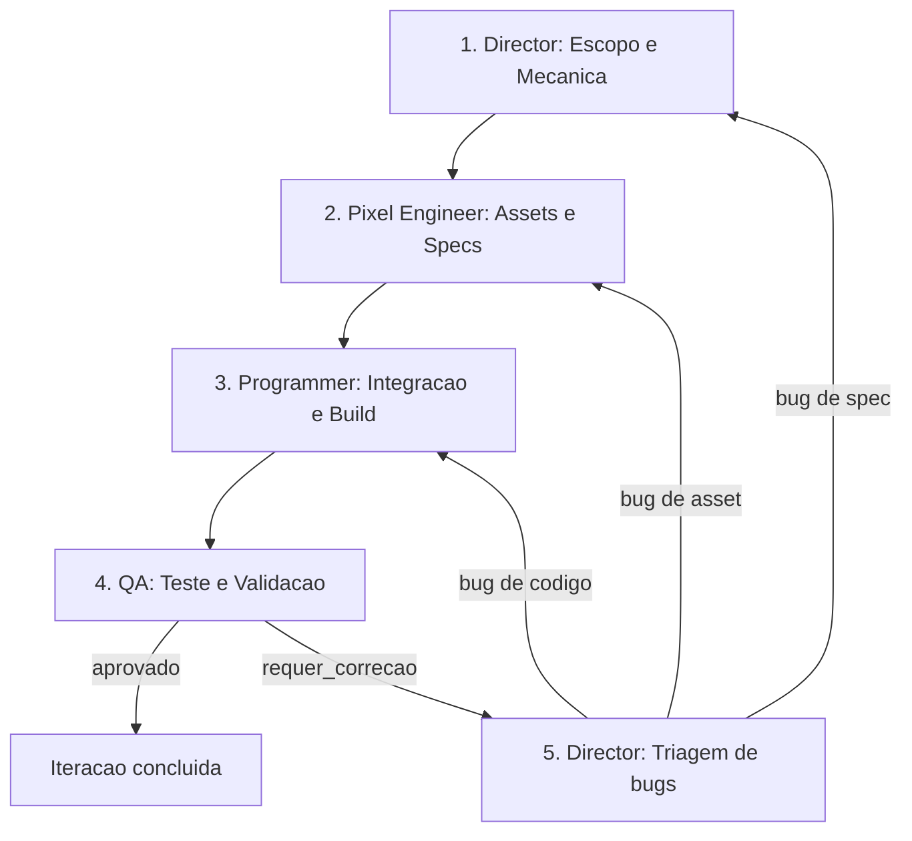

# Workflow: Production Loop

Use este fluxo para o pipeline completo de producao de uma iteracao: do design a entrega validada.

Este e o ciclo operacional do estudio 16-bits. Cada passo tem um agente responsavel e criterios de saida claros. Nenhum passo pode ser pulado.

---

## Pipeline: Design -> Art -> Code -> QA -> Iteracao

### 1. Director define Escopo e Mecanica

**Agente**: `game-director-sgdk`

- Consultar GDD (`doc/11-gdd.md`) e spec de cenas (`doc/13-spec-cenas.md`).
- Delimitar o escopo da iteracao: cena, mecanica ou feature especifica.
- Decompor em tarefas acionaveis com criterios de aceitacao.
- Emitir briefings claros para Pixel Engineer e Programadores.
- **Criterio de saida**: briefing emitido com escopo, assets necessarios e criterios de aceitacao documentados.

### 2. Pixel Engineer define e audita Assets

**Agente**: `mega-drive-pixel-engineer`

- Receber briefing do Director.
- Consultar budget de VRAM da cena via `megadrive-vdp-budget-analyst`.
- Projetar assets dentro das `megadrive-pixel-strict-rules`: dimensoes, paleta, frames.
- Auditar cada asset contra o checklist de validacao.
- Especificar entradas `.res` com dimensoes, paleta e compressao.
- **Criterio de saida**: todos os assets com status `aprovado` ou `aprovado_com_ajustes`, specs de `.res` entregues, budget de VRAM confirmado como `cabe` ou `cabe com recuo`.

### 3. Programmer (Scene Architect) integra Logica, Sprites e Audio

**Agentes**: `sgdk-runtime-coder`, `scene-state-architect`, `sgdk-build-wrapper-operator`, `megadrive-vdp-budget-analyst`

- Receber specs de assets e briefing de mecanica.
- Implementar logica de cena, integracao de sprites, tilemap e audio (XGM2).
- Respeitar arquitetura modular (`scene-state-architect`).
- Registrar entradas `.res` conforme specs do Pixel Engineer.
- Executar build local para verificar compilacao.
- **Criterio de saida**: codigo compilando sem erros, assets integrados, build gerando ROM.

### 4. Build e QA auditam ROM gerada

**Agente**: `qa-hardware-tester`

- Executar `rebuild.bat` para build limpo e reprodutivel.
- Analisar `validation_report.json`.
- Testar ROM em BlastEm (obrigatorio para gate) e BizHawk (recomendado para telemetria e frame advance).
- Verificar boot, gameplay, transicoes, audio e performance.
- Preencher tabela de status por eixo de validacao.
- **Criterio de saida**: tabela de 7 eixos preenchida, issues documentadas com evidencia, `validation_report.json` coerente com `runtime_metrics.json` e recomendacao emitida.

### 5. Iteracao e correcao de bugs (Loop de QA)

**Agentes**: `game-director-sgdk` (triagem), demais agentes (correcao)

- Director recebe report do QA e prioriza issues.
- Bugs de asset voltam ao `mega-drive-pixel-engineer`.
- Bugs de codigo voltam ao programador.
- Bugs de spec/escopo voltam ao Director para reavaliacao.
- Cada correcao repassa pelos passos 2-4 conforme necessario.
- **Criterio de saida**: QA emite `aprovado_para_iteracao` ou `validado` em hardware real.

---

## Regras do loop

- **Nenhum passo pode ser pulado.** Mesmo iteracoes pequenas passam por Design -> Art -> Code -> QA.
- **Feature creep e bloqueado** no passo 1. Se nao esta no GDD, nao entra na iteracao.
- **Assets nao validados nao entram no build.** O Pixel Engineer e o gate obrigatorio.
- **ROM nao testada nao e entregue.** O QA e a ultima linha de defesa.
- **Handoff entre passos deve ser explicito**: quem entrega, o que entrega, quem recebe.
- **Evidencia e obrigatoria**: logs, reports, screenshots. Nao aceitar "funciona" sem prova.
- **Emulador de entrega e unico**: BlastEm fecha gate; BizHawk complementa, Exodus diagnostica, Gens KMod nao aprova entrega.

---

## Diagrama do ciclo

