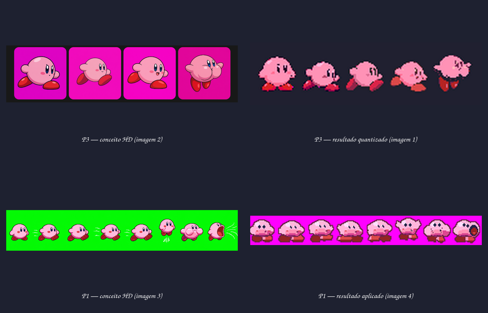

# A1 — conceito versus aplicação

## P3: imagem 2 → imagem 1

**Imagem 2** é o conceito de frames em resolução alta: define forma, expressão,
proporção, pés e pose antes da limitação técnica.

**Imagem 1** é a aplicação P3. Cada frame identifica o magenta de fundo, recorta
a silhueta, reduz por nearest-neighbor e passa por quantização/indexação. O
pós-processamento limpa transições suaves e ruído sem redesenhar a geometria.

Resultado: P3 preservou mais da pose e do volume da fonte, mas sua redução
automática continuou visualmente insuficiente. A tentativa foi arquivada em
`data/archive/p3_2026-08-06_geometry_preserved_pixelization_rejected/`; não
existe sheet final nem promoção para `res/`.

## P1: imagem 3 → imagem 4

**Imagem 3** é uma referência HD de sequência: comunica idle, corrida, salto,
float e inalação em formas mais ricas.

**Imagem 4** é a aplicação P1. O método não reduziu o conceito: o builder Python
redesenhou cada célula em 32×32 com formas procedurais e paleta limitada, depois
passou nos validadores mecânicos.

Resultado: P1 ganhou uma strip tecnicamente regular, mas perdeu volume, acting e
diferença entre poses existentes na imagem 3. Por isso passou os checks de PNG e
ainda foi reprovada visualmente.

## O que mudou na metodologia

| Etapa | P1 | P3 |
|---|---|---|
| Fonte da forma | formas recriadas por Python | frame HD preservado como fonte |
| Transformação | reconstrução procedural em 32×32 | recorte + nearest-neighbor + quantização |
| Papel da técnica | define também a geometria | limpa e adapta a geometria já aprovada |
| Risco principal | simplificar demais o personagem | perder detalhe durante a redução |
| Estado | arquivada por falha visual | arquivada por pixelização automática; P4 aguarda master vetorial aprovado |

Este quadro não promove assets para `res/`; serve para decidir qual método
conserva melhor o conceito antes de completar a animação.
