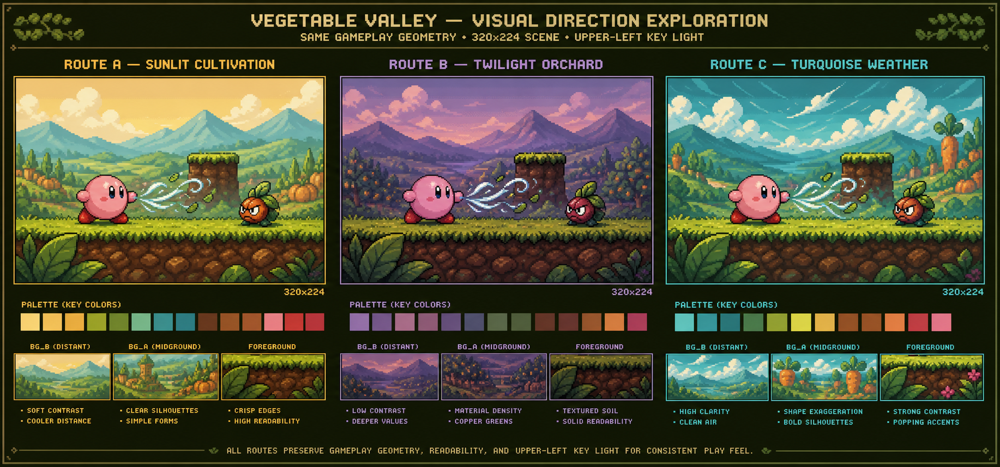
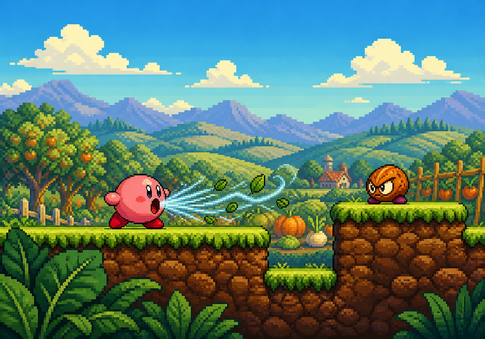

# Painel comparativo — direção visual e câmera de gameplay

Este painel é editorial e de revisão; nenhuma imagem abaixo é fonte de pixels para `res/`.

## 1. Estado do personagem

| Atual/model sheet route | Revisado nesta sessão |
|---|---|
| [hero_model_sheet_v01.png](../../../data/source_art/model_sheet_v01/hero_model_sheet_v01.png) — braços fundidos, pés com vão, `back`/`3/4 back` sem giro suficiente | [revised_character_model_sheet_v01.png](../../../rascunho/nexialist_visual_nucleus_v01/revised_character_model_sheet_v01.png) — braço separado, contato de base, marcas faciais, volumes traseiros distintos |

O board histórico [REVIEW_BOARD.png](../../../out/evidence/model_sheet_route/REVIEW_BOARD.png) e [a1_attempts_comparison_board.png](../../../doc/art/evidence/a1_attempts_comparison_board.png) permanecem como evidência negativa/diagnóstica de P1–P4; não entram como fonte.

## 2. Rotas e cena





| Rota | Câmera 320×224 / gameplay | Papel cromático | Risco de VDP |
|---|---|---|---|
| A — Sunlit Cultivation | hero no terço esquerdo, inimigo no direito, ledge e gap no eixo jogável | creme/ciano distante; verde/âmbar jogável; coral/carmesim de atores; ciano-branco de FX | textura de fundo precisa virar kit modular; não usar bitmap full-screen |
| B — Twilight Orchard | mesma posição de atores e plataformas; só temperatura/densidade mudam | violeta/cobre, valores mais profundos | pode apagar pés, inimigo e collision edge |
| C — Turquoise Weather | mesma geometria; formas e FX mais energéticos | turquesa/verde, coral de ameaça | fundo pode competir com hero e gastar detalhes/tiles |

## 3. Áreas de leitura

```text
Y=000..023  HUD-safe strip / céu respirado
Y=024..104  BG_B: céu + montanhas distantes
Y=105..153  BG_B: colinas/orchard intermediário
Y=154..169  BG_A: plataforma/ledge e borda de colisão
Y=170..189  BG_A: solo e gap; atores ancoram no topo
Y=190..223  foreground: folhas esparsas, sem cobrir pés ou collision edge
X=000..064  foreground leaf cluster / entrada visual
X=080..112  hero envelope nominal 32×32
X=116..196  inhale wind / leaves, gameplay signal
X=220..252  enemy envelope nominal 32×32
X=256..319  ledge/foreground counterweight
```

## 4. Recomendação e riscos

**Recomendação:** selecionar A para Vegetable Valley; preservar a densidade material de B apenas em BG_B e o gesto de vento de C apenas no FX. O personagem revisado é candidato de model sheet, não sprite final.

Riscos que permanecem abertos: arte rica ainda não foi reinterpretada em tiles nativos; paleta final e conflitos por tile não foram medidos; residência de BG_A/BG_B não foi calculada por `rescomp`; `Shadow/Highlight` exige auditoria de slots; a cena nova não tem ROM/BlastEm/live-scene evidence. O budget preliminar mediu 12 links / 4 sprites por linha no layout base, 20 links / 7 por linha no degrau seguinte, e overflow de pixels em 336/320 no stress probe.
