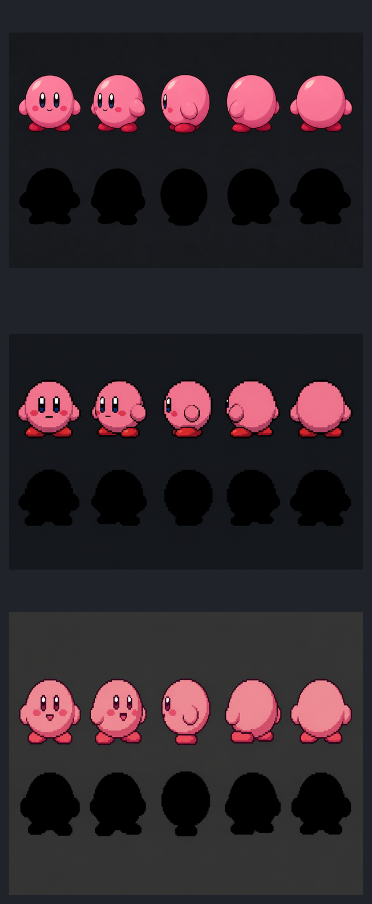

# Painel de comparação — v02 / v03-A / v03-B

| Folha | Papel | Estado |
|---|---|---|
| [v02](../../../rascunho/nexialist_visual_nucleus_v01/model_sheet_challenger_v02.png) | turnaround volume reference only | `rework_before_native_translation` |
| [v03-A cluster_strict](../../../rascunho/nexialist_visual_nucleus_v01/model_sheet_challenger_v03_a_cluster_strict.png) | geometria do v02 com clusters/rampas discretas | challenger pendente |
| [v03-B silhouette_first](../../../rascunho/nexialist_visual_nucleus_v01/model_sheet_challenger_v03_b_silhouette_first.png) | simplificação interna para leitura em 32×32 | `comparison_only`; gerado sem referência após bloqueio da ferramenta |

## Diferenças observáveis

- **v02:** volume mais renderizado, brilho e gradientes; útil somente para continuidade de massa, ângulos, baseline, conexão dos braços e orientação facial.
- **v03-A:** melhor preservação de volume e orientação; clusters mais duros, mas ainda há risco de microcores e suavidade high-res.
- **v03-B:** internos mais econômicos e silhueta mais forte; foi gerado sem referência explícita por bloqueio de saída, portanto não é revisão fiel do v02.

## Decisão de estilo

Não promover nenhum dos três. A próxima arte nativa deve ser redesenhada manualmente a partir da direção Sunlit Cultivation, DNA visual e challenger aprovado — não de um PNG high-res.
