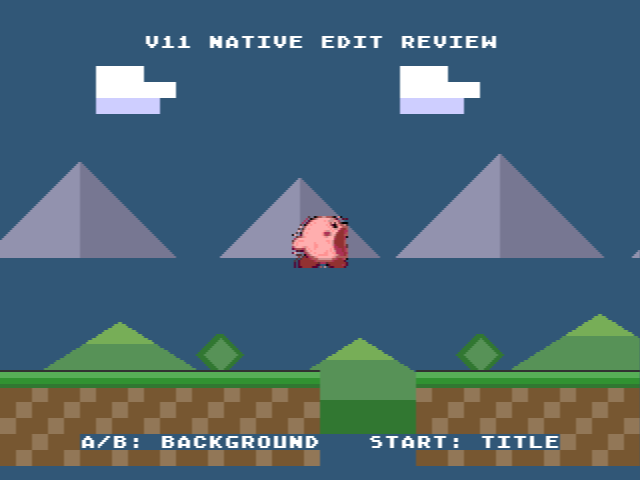

# V11 — first native visual candidate

## Scope and truth state

This review branch authorizes production of full visual candidates and runtime
integration for review. It does not authorize mainline promotion or human final
acceptance. The current claim ceiling is:

```text
status=full_visual_runtime_candidate
visual_pass=false
human_gate_ready=true
final_acceptance=false
ready_for_aaa=false
```

The v10 decisions remain history and are superseded only for the review-branch
scope; v10 ROMs and evidence are preserved unchanged.

## First causal package: `run_contact`

The bridge is `forge-art native-edit`. It consumes the explicit action document
`data/staging/v11_native_edit/run_contact_actions.json`, starts from a transparent
32×32 canvas, and writes only `out/v11_native_edit/run_contact_v2/`. No v04–v10
pixel is used as a source. The sole identity authority is:

```text
data/source_art/r1/r1-01/concept.png
sha256=591d310623aaf37426af1cb846a715c1fd88e905163364d64565278ed31303cd
```

The persisted producer image and grid attempt are underlays only. The action
log records 38 editor-authored operations with semantic symptom, reference,
before/after indices, reason and operator for every action.

## Technical result

| Evidence | Result |
|---|---|
| PNG | 32×32, indexed P, 4-bit, index 0 transparent |
| Palette | 10 visible colors, VDP authoring grid |
| Static pixel contract | pass, zero blockers |
| Source SHA before/after | identical to R1 authority |
| Nearest 8× comparison | emitted and inspected |
| Candidate SHA | `a25fc55e49ab5b69892fb0e9fa62ed8844e183c7518492316da55c3f085c6c3b` |
| Canonical content SHA | `92fb3b8b44fc7de4c9fe8f292a16ed0b7b1616c0f8e0edb1068d1e47660fb7da` |

Technical validity does not approve silhouette, anatomy, material, identity or
readability. Human review is still required.

## Review-scene integration

The candidate is copied into the explicitly named `v11_review` resource scope
and displayed by `APP_SCENE_NATIVE_ART_REVIEW` when `B` is pressed. The existing
v10 controls remain available through `A`; gameplay placeholders and the
first-playable scene are untouched. The resource is classified
`native_candidate` in `doc/asset_provenance_manifest.json`.

## Real runtime proof

The review resource was compiled through the SGDK wrapper and captured in
BlastEm at `APP_SCENE_NATIVE_ART_REVIEW` (scene 11). The sealed bundle is:

`out/evidence/v11_run_contact/blastem-linux-20260904T084548Z-2942661/`

| Evidence | Result |
|---|---|
| ROM SHA-256 | `55b5759a27e18e0064653a285b80dcef378397c777f63704ed05025faa2e3b8c` |
| Scene identity | pass, requested/measured 11 |
| Runtime window | 600 frames, 60.2 fps |
| CPU | p99 21%, zero over-budget frames |
| VDP sprites | peak 1/frame and 1/sample scanline |
| VRAM | 32128 bytes declared below 0xC000 |
| Harness hard gates | pass; one soft KRB1 telemetry warning |



This proves consumption by the correct review scene and the measured baseline
window. It does not prove final visual quality, animation cohesion,
first-playable replacement, or AAA readiness. `human_gate_ready=true` means the
technical candidate is ready for human review; `visual_pass=false` and
`final_acceptance=false` remain authoritative.

## Next causal package

Compare this contact against the R1 identity at 1×, then author the next key
pose with the same bridge. Do not begin animation strips, stage replacement,
enemy, boss or ability promotion until the contact pose has passed the human
gate and its runtime capture is bound to the v11 ROM SHA.
