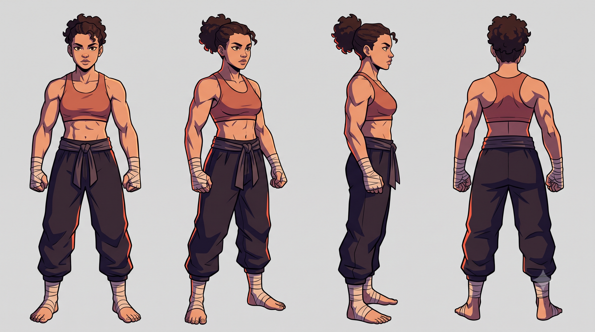
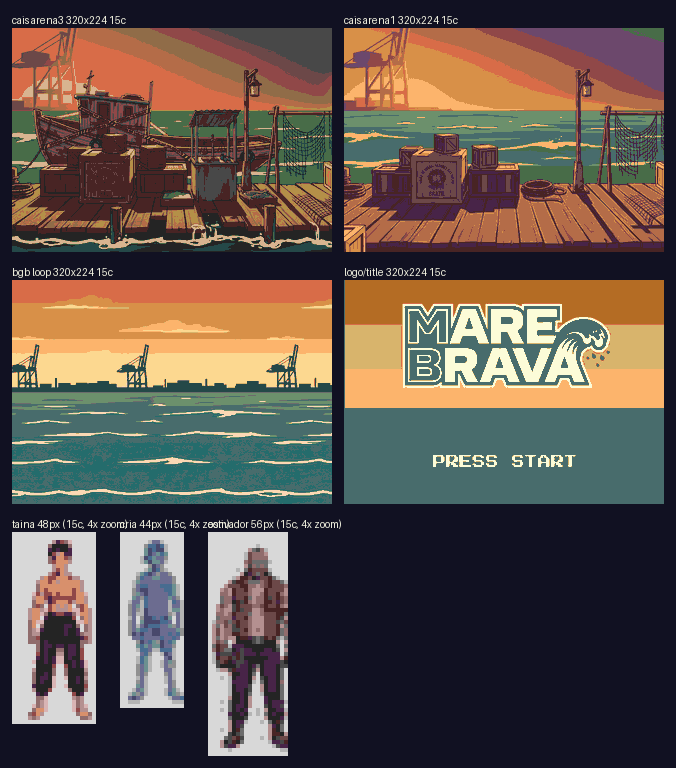
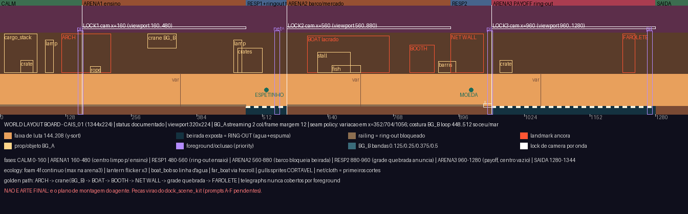
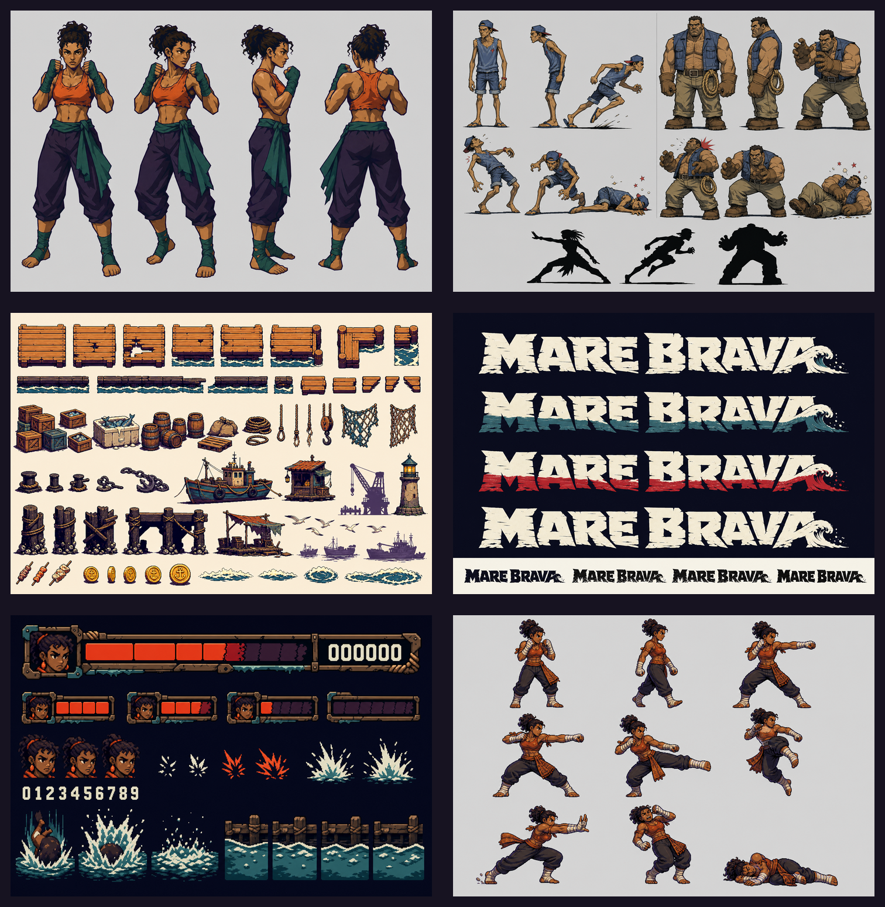
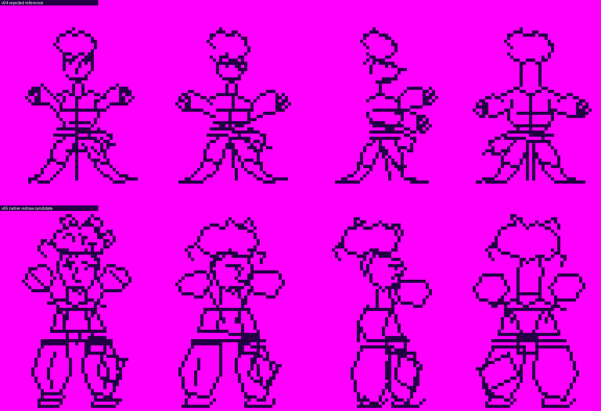
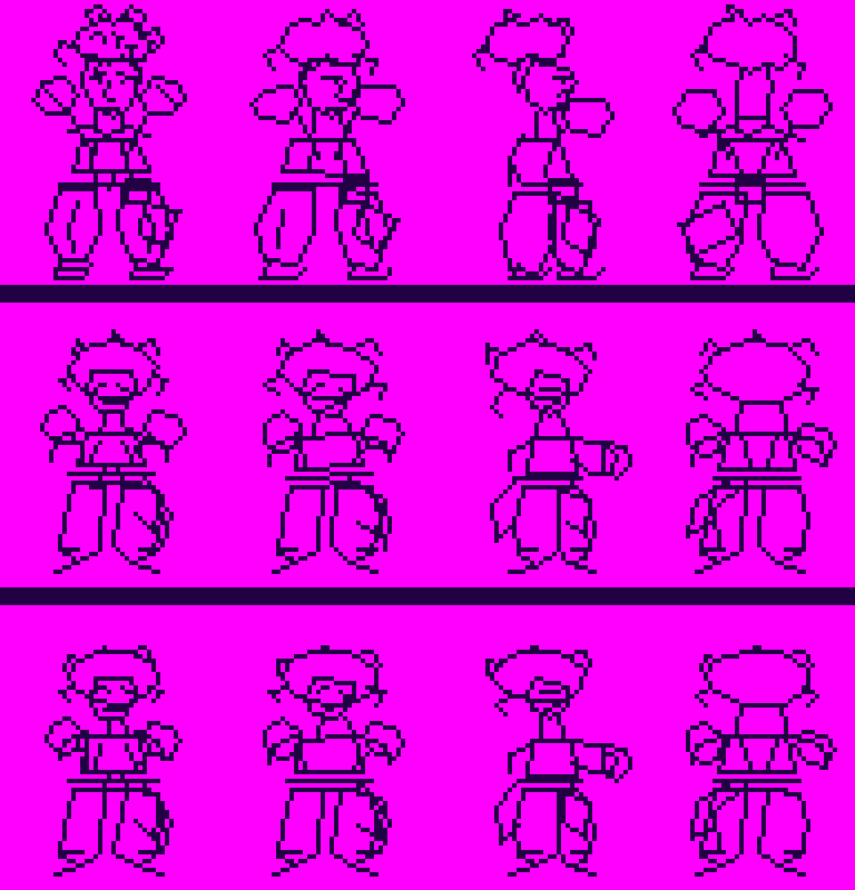
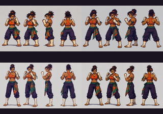
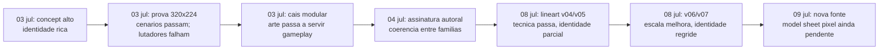

# 22 - Linha do Tempo Visual — MARE BRAVA VER.001

Este apendice permite comparar as imagens que orientaram as mudancas de rota.
Cada quadro declara seu papel: concept, prova offline, documento de montagem
ou candidato tecnico. Nenhuma imagem abaixo deve ser interpretada como asset
final de gameplay, salvo indicacao expressa nos manifests — que nao existe na
VER.001.

## 2026-07-03 — identidade em concept de alta resolucao

**Decisao mapeada:** usar a imagem para identificar roupa, cabelo, guarda e
atitude, mas nao para exportar sprite diretamente. A proporcao realista do
concept nao corresponde ao alvo de aproximadamente 3,5 cabecas em 48x64.

**Mudanca de estilo que inicia:** da ilustracao de personagem para a busca de
uma silhueta de brawler compacta, angular e legivel no tamanho nativo.

## 2026-07-03 — prova de sobrevivencia no viewport Mega Drive

**Decisao revisada:** cenario, BG e logo sobrevivem bem a reducao; personagem
nao. A prancha prova que horizonte, tablado, ondas, contrastes quente/frio e
logo mantem leitura. Ela tambem torna visivel a perda de rosto, cabelo e pose
nos lutadores reduzidos diretamente.

**Mudanca de estilo:** o cenario pode seguir uma traducao por massas, planos e
paleta; a personagem precisa passar por model sheet pixel e lineart nativo.

## 2026-07-03 — do panorama para o palco jogavel modular

**Decisao revisada:** os paines do cais deixaram de ser candidatos a background
pronto. O board transforma a imagem em sistema de cena: faixa de luta, beirada
de agua, bloqueios de ring-out, landmarks, costuras e janelas de streaming.

**Mudanca de estilo:** de composicao ilustrada unica para ecologia modular em
BG_A, BG_B, foreground e sprites; o acabamento visual passa a servir camera e
gameplay.

## 2026-07-04 — contrato de traco autoral e lote de validacao

**Decisao mapeada:** substituir adjetivos genericos de estilo por assinatura de
linha, hooks de silhueta, gramatica facial, assimetria de figurino e materiais.
O lote e `source_candidate`; um kit do cais com rotulos foi descartado, em vez
de ser aproveitado como arte de cena.

**Mudanca de estilo:** a direcao passa a cobrar autoria coerente entre TAINA,
inimigos, cenario, logo e HUD, e nao apenas uma aparencia 16-bit aceitavel.

## 2026-07-08 — primeira traducao nativa: limpeza nao basta

**Decisao revisada:** v05 recupera mais cabelo cacheado, face wedge, guarda,
luvas, faixa e calca que v04, mas ainda cai em escala chibi. Os arquivos passam
PNG indexado, grid e index 0; isso nao autoriza color blocking nem `res/`.

**Mudanca de estilo:** a correcao deixa de ser apenas "limpar pixels" e passa a
preservar topologia, postura, identidade e peso corporal.

## 2026-07-08 — escala corrigida, identidade perdida de novo

**Decisao revisada:** v07 aproxima os pes do pivot e corrige parte da altura,
mas simplifica cabelo, face e mecanica da guarda. O status correto e
`scale_probe_not_promoted`, nao uma nova fonte de geracao.

**Mudanca de estilo:** escala e silhueta precisam ser corrigidas sem apagar as
features que faziam TAINA ser TAINA. O proximo candidato deve combinar a
identidade de v05 com a licao espacial de v07, a partir do model sheet aceito.

## 2026-07-09 — retorno a fonte conceitual mais compacta

**Decisao mapeada:** quatro novas variacoes foram geradas; duas seguiram como
`source_candidate` e duas foram descartadas por drift anatomico alto/
ilustrativo. A fonte agora sobrevive melhor a miniatura e oferece material mais
adequado para o proximo model sheet pixel.

**Mudanca de estilo:** a rota retorna temporariamente ao concept para recuperar
identidade antes de reiniciar o desenho em grid; nao e retrocesso, e controle
de qualidade da linhagem visual.

## Leitura de uma olhada

O padrao importante e que as revisoes nao caminham apenas para "mais detalhe".
Elas retiram informacao que nao sobrevive ao VDP, preservam landmarks de
identidade e transferem decisoes de cena para estruturas jogaveis e modulares.

## Evidencias

- `data/source_art/taina_model_sheet/taina_turnaround_v01.png`
- `data/processed/contact_sheets/vdp_survival_contact_sheet_v01.png`
- `doc/art/world_layout_board_1344x224.png`
- `data/processed/contact_sheets/authorial_style_validation_contact_sheet_v01.png`
- `doc/art/characters/taina/review/taina_lineart_v04_v05_compare_8x_v01.png`
- `doc/art/characters/taina/review/taina_lineart_v05_v06_v07_compare_6x_v01.png`
- `doc/art/characters/taina/review/taina_identity_turnaround_native_callable_contact_sheet_320x224_v01.png`
