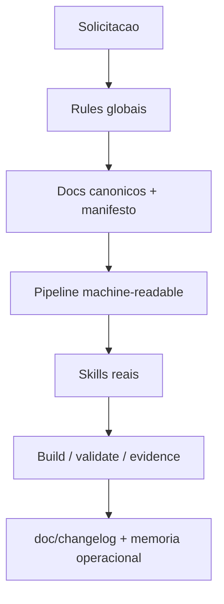

# SGDK Agent Framework Architecture

> Framework canonico de agentes para projetos `MegaDrive_DEV`, hospedado em `tools/sgdk_wrapper/.agent`.

---

## Objetivo

Esta `.agent` padroniza o comportamento de IAs que atuam em projetos SGDK do workspace.

Ela existe para:

- reforcar a hierarquia de verdade documental
- proteger budgets e limites reais do Mega Drive
- centralizar a logica operacional no wrapper
- separar claramente `documentado`, `implementado`, `buildado`, `testado_em_emulador` e `validado_budget`
- impedir que uma IA trate narrativa bonita como evidência suficiente
- garantir cadeia deterministica entre build, ROM, emulador, changelog e memoria operacional

---

## Fonte de Verdade

### Framework

- Fonte canonica: `tools/sgdk_wrapper/.agent`
- Materializacao local: `<projeto>/.agent`
- Politica de copia: bootstrap automatico apenas quando a pasta local nao existir
- Politica de sobrescrita: proibida por padrao
- Politica de cura segura: caminhos canonicos ausentes podem ser copiados da fonte central apenas quando o destino ainda nao existir

### Projeto SGDK

Quando houver conflito entre documentos do projeto, a ordem recomendada continua:

1. `doc/10-memory-bank.md`
2. `doc/11-gdd.md`
3. `doc/13-spec-cenas.md`
4. `doc/00-diretrizes-agente.md`
5. `doc/12-roteiro.md`
6. `doc/03-arquitetura.md`
7. `.mddev/project.json`
8. `README.md`

Se um documento de menor prioridade contradizer um superior, ele deve ser tratado como desatualizado.

---

## Bootstrap Local

Uma `.agent` local so e considerada saudavel quando possui:

- `ARCHITECTURE.md`
- `framework_manifest.json`
- skills e workflows criticos listados em `framework_manifest.json > tracked_paths`
- pipeline machine-readable atual

Estados validos:

- `bootstrapped`: copia local presente e coerente com o minimo canonico
- `tracked_paths_healed`: faltavam caminhos canonicos ausentes e eles foram materializados sem sobrescrever arquivos locais
- `degradado`: faltam caminhos criticos, ha drift relevante ou o manifesto local nao representa mais a fonte canonica

Regra:

- `.agent` local incompleta nao e "quase boa"
- ela deve ser tratada como contexto invalido ate cura segura ou auditoria humana

---

## Estrutura Canonica

```text
.agent/
  ARCHITECTURE.md
  framework_manifest.json
  rules/
  skills/
  workflows/
  pipelines/
  scripts/
  lib_case/
```

### Responsabilidades

- `rules/`: regras sempre ativas e nao negociaveis
- `skills/`: conhecimento acionavel por dominio, com contrato operacional explicito
- `workflows/`: runbooks operacionais curtos
- `pipelines/`: jornadas machine-readable
- `scripts/`: automacoes de status, auditoria, changelog e verificacao
- `lib_case/`: few-shots pedagogicos e referencias reproduziveis

---

## Modelo Operacional



### Regra principal

O fluxo canonico de uma cena AAA nao e definido por personas ficticias.

Ele e definido por:

1. `pipelines/aaa_scene_v1.json`
2. `workflows/aaa-scene-pipeline.md`
3. `workflows/production-loop.md`
4. as `SKILL.md` reais invocadas por cada etapa

Workflows descrevem ordem.
Skills descrevem como executar.
Validator e wrapper fecham o gate.

---

## Pipeline AAA de Cena

Para trabalho de cena visual, a cadeia oficial e:

1. `art/art-asset-diagnostic`
2. `art/multi-plane-composition`
3. `art/art-translation-to-vdp`
4. `art/visual-excellence-standards`
5. `hardware/megadrive-vdp-budget-analyst`
6. `code/sgdk-runtime-coder`
7. `validate_resources.ps1`
8. BlastEm + `workflows/build-validate.md`

Nenhuma etapa pode ser pulada.

Se o passo anterior nao emitiu os artefatos minimos, o passo seguinte nao tem permissao para se declarar concluido.

---

## Contrato de Evidencia

Nenhuma validacao em emulador e confiavel sem vinculo explicito com a ROM testada.

A cadeia minima de evidencia e:

1. build final
2. identidade da ROM
3. sessao do emulador
4. captura dedicada
5. consolidacao em `validation_report.json`
6. snapshot em `doc/changelog`
7. bloco derivado em `doc/10-memory-bank.md`

Se qualquer build ocorrer depois da captura, a evidencia anterior passa a ser `stale`.

---

## Changelog Canonico do Projeto

Cada projeto deve manter `doc/changelog/` como trilha operacional minima.

Estrutura obrigatoria:

```text
doc/changelog/
  changelog.md
  assets/<asset_id>/v###/<arquivo_original>
  assets/<asset_id>/v###/meta.json
  roms/build_v###/rom.bin
  roms/build_v###/build_meta.json
```

Regras:

- asset novo so gera versao nova quando o binario realmente muda
- ROM nova so gera `build_v###` quando o hash muda
- a memoria operacional nao pode subir tom acima do que os artefatos realmente sustentam

---

## Skills

As skills centrais deste framework devem expor explicitamente:

- `entrada minima`
- `saida minima`
- `passa quando`
- `handoff para proxima etapa`

Se uma skill nao deixa claro o que consome e o que entrega, ela nao esta apta para orquestrar outra IA de forma confiavel.

---

## Lib Case e Few-Shot

Few-shots canonicos vivem em `lib_case/` e existem para impedir regressao em erros caros.

Os casos mais importantes para este framework sao:

- `PALETTE_INFLATED`
- overflow real de VRAM por tiles unicos
- decisao errada entre `IMAGE`, `MAP` e streaming

Esses casos devem ser usados como memoria reproduzivel, nao como narrativa informal em chat.

---

## Painel de Status

O status panel continua assumindo, no minimo:

- `documentado`
- `implementado`
- `buildado`
- `testado_em_emulador`
- `validado_budget`
- `placeholder`
- `parcial`
- `futuro_arquitetural`
- `agent_bootstrapped`

Novos bloqueios canonicos tambem devem ficar rastreaveis em `validation_report.json`:

- `agent_context_degraded`
- `budget_doc_mismatch`
- `visual_gate_blocked`
- `emulator_evidence_stale`
- `changelog_missing`

---

## Limites Intencionais

Esta `.agent` nao deve:

- inventar API do SGDK
- autorizar features fora do GDD
- normalizar `float`, heap no loop ou DMA inseguro
- tratar `.agent` local incompleta como contexto confiavel
- chamar de `AAA`, `validado` ou `pronto` uma cena sem BlastEm, budget coerente e changelog atualizado

---

## Evolucao Esperada

Novas skills, workflows e scripts sao bem-vindos se preservarem:

- modularidade
- auditabilidade
- explicabilidade
- aderencia ao hardware real
- centralizacao da operacao no wrapper
- continuidade entre build, validação, changelog e memoria operacional
