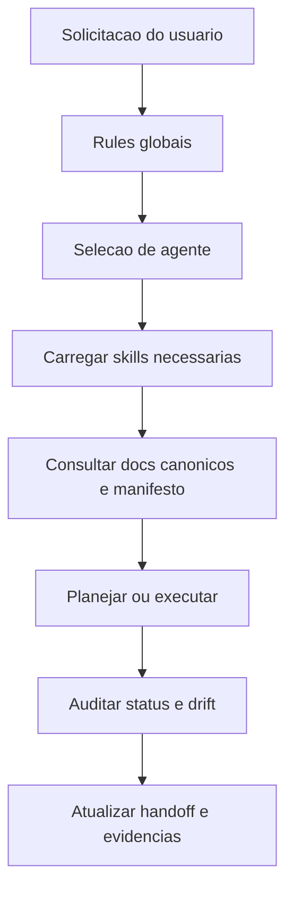

# SGDK Agent Framework Architecture

> Framework canonico de agentes para projetos `MegaDrive_DEV` hospedado em `tools/sgdk_wrapper/.agent`.

---

## Objetivo

Esta `.agent` existe para padronizar o comportamento de IAs que atuam em projetos SGDK do workspace.

Ela foi desenhada para:

- reforcar governanca documental e hierarquia de verdade
- proteger budgets e restricoes de hardware do Mega Drive
- manter a logica operacional no wrapper central
- separar claramente documentado, implementado, buildado, testado e placeholder
- reduzir deriva entre manifesto, codigo, documentacao e status real

---

## Regra de hospedagem

- Fonte canonica: `tools/sgdk_wrapper/.agent`
- Materializacao local: `<projeto>/.agent`
- Politica de copia: apenas bootstrap quando a pasta local nao existir
- Politica de sobrescrita: **proibida por padrao**

Os wrappers centrais garantem o bootstrap automatico para projetos novos e antigos.

---

## Estrutura

```text
.agent/
  ARCHITECTURE.md
  agents/
  rules/
  skills/
  workflows/
  scripts/
```

### Responsabilidades

- `rules/`: regras sempre ativas e nao negociaveis
- `agents/`: personas especializadas por dominio
- `skills/`: conhecimento reutilizavel e carregavel por contexto
- `workflows/`: runbooks operacionais
- `scripts/`: automacoes de status, auditoria e verificacao

---

## Hierarquia de verdade SGDK

Quando houver conflito, a ordem recomendada e:

1. `doc/10-memory-bank.md`
2. `doc/11-gdd.md`
3. `doc/13-spec-cenas.md`
4. `doc/00-diretrizes-agente.md`
5. `doc/12-roteiro.md`
6. `doc/03-arquitetura.md`
7. `.mddev/project.json`
8. `README.md`

Se um documento de menor prioridade contradizer um superior, ele deve ser tratado como desatualizado.

---

## Modelo operacional



---

## Agentes iniciais

- `project-planner-sgdk`: descoberta, plano e enquadramento de escopo
- `governance-auditor`: hierarquia de verdade, gates, handoff e anti-deriva
- `hardware-budget-guardian`: VRAM, DMA, sprites, H-Int e riscos de cena
- `build-wrapper-operator`: wrappers, manifesto, layout, build policy e rastreabilidade

---

## Skills iniciais

### Governanca

- `truth-hierarchy-guard`
- `doc-sync-audit`

### Operacao

- `sgdk-build-wrapper-operator`
- `status-panel-maintainer`

### Hardware

- `megadrive-vdp-budget-analyst`

### Arquitetura

- `scene-state-architect`

---

## Painel de status

O framework assume um painel unico com, no minimo, estes eixos:

- `documentado`
- `implementado`
- `buildado`
- `testado_em_emulador`
- `validado_budget`
- `placeholder`
- `parcial`
- `futuro_arquitetural`
- `agent_bootstrapped`

`agent_bootstrapped` indica se o projeto ja possui a `.agent` local materializada a partir da fonte canonica.

---

## Integracao com wrappers

Os seguintes scripts do wrapper participam do bootstrap automatico da `.agent`:

- `build.bat`
- `build_inner.bat`
- `run.bat`
- `rebuild.bat`
- `clean.bat`
- `env.bat`
- `new_project.bat`

O bootstrap e centralizado em `ensure_project_agent.bat` + `ensure_project_agent.ps1`.

---

## Limites intencionais

Esta `.agent` nao deve:

- inventar API do SGDK
- autorizar features fora do GDD
- normalizar `float`, heap no loop ou DMA inseguro
- sobrescrever `.agent` local customizada sem ordem explicita
- mentir status de validacao sem evidencia operacional

---

## Evolucao esperada

Evolucoes futuras devem adicionar novos agentes e skills sem perder estes principios:

- modularidade
- auditabilidade
- explicabilidade
- aderencia ao hardware real
- centralizacao da operacao no wrapper
