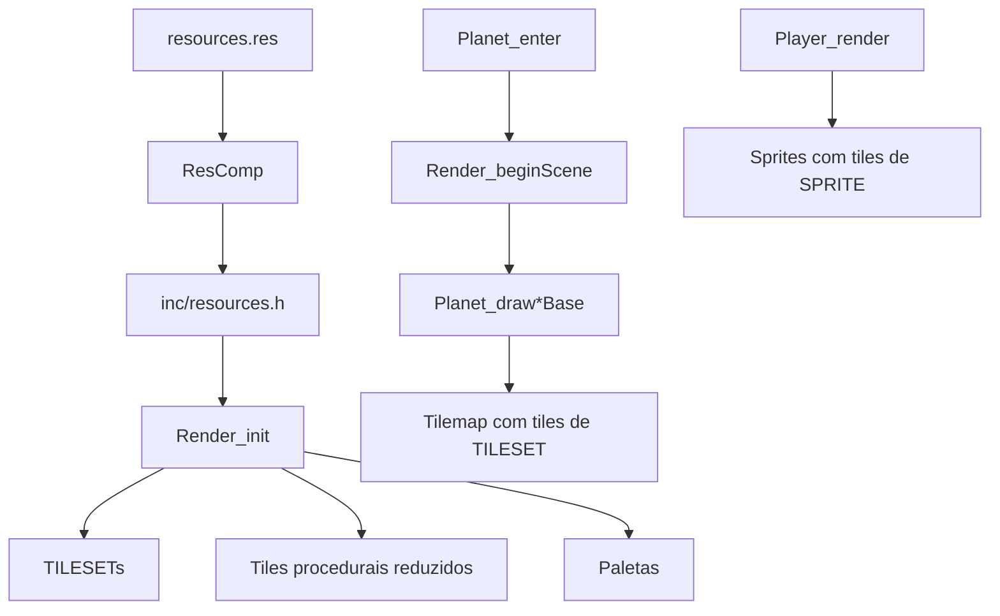

# 20 - Estrategia de Integracao de Assets

**Versao:** 1.0
**Data:** 2026-03-16
**Contexto:** Fase 1 — Plano de alteracoes no codigo para carregar assets reais

> Este documento descreve como o codigo sera alterado para substituir placeholders
> por TILESETs e SPRITEs, mantendo budgets de VRAM/DMA/sprites respeitados.

---

## 1. VISAO GERAL



---

## 2. ALTERACOES EM `resources.res`

### 2.1. Novas entradas

```
PALETTE pal_prince "gfx/player/pal_prince.bmp"

SPRITE spr_prince_planet "gfx/player/prince_planet.png" 4 4 NONE 0 NONE NONE
SPRITE spr_scarf_segment "gfx/player/scarf_segment.png" 1 1 NONE 0 NONE NONE
SPRITE spr_halo_quad "gfx/effects/halo_quad.png" 2 2 NONE 0 NONE NONE

TILESET ts_b612_bg "gfx/planets/b612_bg.png" NONE NONE ROW
TILESET ts_king_bg "gfx/planets/king_bg.png" NONE NONE ROW
TILESET ts_lamp_bg "gfx/planets/lamp_bg.png" NONE NONE ROW
TILESET ts_desert_bg "gfx/planets/desert_bg.png" NONE NONE ROW
TILESET ts_travel_bg "gfx/travel/travel_bg.png" NONE NONE ROW
TILESET ts_ui_panels "gfx/ui/ui_panels.png" NONE NONE ROW
```

### 2.2. Ordem de carregamento

Os TILESETs de cenario serao carregados por planeta (swap em enter) ou todos no init, dependendo da estrategia de VRAM. Para o slice, carregar todos no init e usar offsets diferentes por cena e viavel (VRAM comporta).

---

## 3. ALTERACOES EM `inc/project.h`

### 3.1. Novas constantes de tile base

```c
#define PP_TILE_B612_BG_BASE    (PP_TILE_RESOURCE_BASE + PP_TOTAL_RESOURCE_TILES)
#define PP_TILE_KING_BG_BASE    (PP_TILE_B612_BG_BASE + 30)
#define PP_TILE_LAMP_BG_BASE    (PP_TILE_KING_BG_BASE + 30)
#define PP_TILE_DESERT_BG_BASE  (PP_TILE_LAMP_BG_BASE + 30)
#define PP_TILE_TRAVEL_BG_BASE  (PP_TILE_DESERT_BG_BASE + 30)
#define PP_TILE_UI_BASE         (PP_TILE_TRAVEL_BG_BASE + 20)
```

Ou, se VRAM for limitada, usar **carregamento por cena**: apenas o TILESET do planeta ativo fica na VRAM. Nesse caso, `Render_init` carrega apenas marcos + tiles utilitarios; cada `Planet_enter` chama `VDP_loadTileSet` para o TILESET do planeta.

### 3.2. Reducao de tiles procedurais

- Manter `Render_buildTiles` apenas para tiles que nao terao arte dedicada (paper, dither, hatch, fill para fallback ou UI).
- Ou remover completamente e usar ts_ui_panels para tudo.
- `PP_TOTAL_GENERATED_TILES` reduzir de 27 para o minimo necessario (ex: 0 se tudo vier de assets).

### 3.3. PP_HW_SPRITES

- Atual: 8. Budget doc/13 prevê 9 com assets finais.
- Ajustar para 9 se halo + marco + corpo + cachecol precisarem.

---

## 4. ALTERACOES EM `src/render/render.c`

### 4.1. Render_init

**Antes:**
```c
void Render_init(void)
{
    Render_buildTiles();
    VDP_loadTileData(gTileBank, PP_TILE_BASE, PP_TOTAL_GENERATED_TILES, DMA);
    VDP_loadTileSet(&ts_rose_mark, PP_TILE_ROSE_MARK, DMA);
    ...
}
```

**Depois (estrategia conservadora — carregamento por cena):**
```c
void Render_init(void)
{
    Render_buildTiles();  // Manter utilitarios (paper, dither, hatch, fill) ou remover
    VDP_loadTileData(gTileBank, PP_TILE_BASE, PP_TOTAL_GENERATED_TILES, DMA);
    VDP_loadTileSet(&ts_rose_mark, PP_TILE_ROSE_MARK, DMA);
    VDP_loadTileSet(&ts_throne_mark, PP_TILE_THRONE_MARK, DMA);
    VDP_loadTileSet(&ts_lamp_mark, PP_TILE_LAMP_MARK, DMA);
    VDP_loadTileSet(&ts_desert_mark, PP_TILE_DESERT_MARK, DMA);
    VDP_loadTileSet(&ts_ui_panels, PP_TILE_UI_BASE, DMA);  // UI compartilhada
    PAL_setPalette(PAL2, gUiPalette, DMA);
    PAL_setPalette(PAL3, pal_sprite_stage.data, DMA);
    PAL_setPalette(PAL2, pal_prince.data, DMA);  // Ou manter gUiPalette e usar pal_prince para sprites
    Render_clearPlayfield();
}
```

**Carregamento de TILESETs de planeta:** Em `Planet_enter` (planets.c) ou em funcao `Render_loadPlanetTiles(PlanetId)` chamada por enter. Isso evita manter 4 x 30 = 120 tiles de cenario na VRAM simultaneamente.

### 4.2. Nova funcao Render_loadPlanetTiles

```c
void Render_loadPlanetTiles(PlanetId planet)
{
    u16 base;
    switch (planet) {
        case PLANET_B612:  base = PP_TILE_B612_BG_BASE;  VDP_loadTileSet(&ts_b612_bg, base, DMA); break;
        case PLANET_KING:  base = PP_TILE_KING_BG_BASE;  VDP_loadTileSet(&ts_king_bg, base, DMA); break;
        case PLANET_LAMPLIGHTER: base = PP_TILE_LAMP_BG_BASE; VDP_loadTileSet(&ts_lamp_bg, base, DMA); break;
        case PLANET_DESERT: base = PP_TILE_DESERT_BG_BASE; VDP_loadTileSet(&ts_desert_bg, base, DMA); break;
        default: return;
    }
}
```

Se usar **slot unico** (apenas um planeta na VRAM por vez), base pode ser fixo (ex: PP_TILE_PLANET_BG_BASE = 64) e os tiles do planeta anterior sao sobrescritos.

### 4.3. Refatoracao de Planet_drawB612Base (planets.c)

**Antes:** Usa PP_TILE_DITHER, PP_TILE_SUN, PP_TILE_GROUND, PP_TILE_HATCH, PP_TILE_TRACE.

**Depois:** Usar offsets do ts_b612_bg. Exemplo:
```c
#define B612_TILE_SKY    (PP_TILE_B612_BG_BASE + 0)
#define B612_TILE_SUN    (PP_TILE_B612_BG_BASE + 1)
#define B612_TILE_GROUND (PP_TILE_B612_BG_BASE + 2)
...
Render_drawSky(B612_TILE_SKY, true, PAL0);
VDP_setTileMapXY(BG_B, TILE_ATTR_FULL(PAL0, FALSE, FALSE, FALSE, B612_TILE_SUN), 30, 6);
Render_drawDisc(BG_A, 20, 19, 7, B612_TILE_GROUND, B612_TILE_HATCH, PAL1);
```

### 4.4. Refatoracao de Render_drawDisc, Render_drawSky, etc.

Estas funcoes recebem indices de tile como parametro. Nao precisam mudar a logica interna — apenas os valores passados mudam (de PP_TILE_* para offsets do TILESET).

### 4.5. Render_drawTravelScene

Substituir PP_TILE_* por offsets de ts_travel_bg. Carregar ts_travel_bg em Render_init ou em States_enter(GAME_STATE_TRAVEL).

---

## 5. ALTERACOES EM `src/game/player.c`

### 5.1. Player_render — corpo

**Antes:**
```c
u16 bodyAttr = TILE_ATTR_FULL(PAL3, TRUE, FALSE, game->player.facingLeft, PP_TILE_PLAYER);
VDP_setSpriteFull(0, game->player.screenX, game->player.screenY, SPRITE_SIZE(2, 3), bodyAttr, 1);
```

**Depois:** Usar sprite sheet carregado. Opcoes:
- **A) Meta-sprite manual:** Calcular indices de tile do sprite sheet por frame de animacao. `PP_TILE_PLAYER` vira `PP_TILE_PRINCE_BASE + frameOffset`.
- **B) SGDK Sprite engine:** Usar `SPR_setSprite` com spr_prince_planet, trocando frame por animacao.

Para manter simplicidade e controle de DMA, **A** e preferivel: carregar o sprite sheet na VRAM (VDP_loadTileSet com tiles do prince), manter tabela de frames (cada frame = 6 ou 8 tiles em layout 2x3 ou 2x4), e em Player_render selecionar o frame baseado em estado (idle, walk, jump, glide, interact).

### 5.2. Player_render — cachecol

**Antes:** PP_TILE_SCARF (procedural).

**Depois:** PP_TILE_SCARF ou tile do spr_scarf_segment. Carregar scarf na VRAM; usar mesmo indice para os 5 sprites.

### 5.3. Player_render — halo

**Antes:** PP_TILE_HALO (4 tiles procedurais).

**Depois:** Tiles do spr_halo_quad. Mesmo layout 2x2.

### 5.4. Tabela de animacao

Introduzir em player.c ou project.h:
```c
typedef enum {
    PRINCE_ANIM_IDLE,
    PRINCE_ANIM_WALK,
    PRINCE_ANIM_JUMP,
    PRINCE_ANIM_GLIDE,
    PRINCE_ANIM_INTERACT
} PrinceAnimId;

static const u16 gPrinceFrameBase[] = { 0, 2, 6, 9, 11 };  // Offsets por animacao
```

Player_update determina o estado; Player_render usa gPrinceFrameBase[estado] + (subframe para walk) para escolher o tile base.

---

## 6. ALTERACOES EM `src/game/planets.c`

### 6.1. Planet_enter (cada cena)

Chamar `Render_loadPlanetTiles(planet)` no enter do planeta, para carregar o TILESET do cenario na VRAM (se usar slot unico).

### 6.2. Planet_draw*Base

Substituir todas as referencias a PP_TILE_* por constantes do TILESET do planeta (B612_TILE_*, KING_TILE_*, etc.).

---

## 7. ORDEM DE EXECUCAO (Fase de implementacao)

1. Adicionar recursos em resources.res (sprites e tilesets) — com arquivos placeholder ou vazios inicialmente.
2. Atualizar project.h com novas constantes.
3. Implementar Render_loadPlanetTiles e chamada em Planet_enter.
4. Refatorar Planet_drawB612Base para usar ts_b612_bg (assumindo que o TILESET tem mesma estrutura de tiles).
5. Repetir para Rei, Lampiao, Deserto.
6. Integrar sprite do player em Player_render (corpo, cachecol, halo).
7. Refatorar Travel e UI.
8. Remover ou reduzir Render_buildTiles conforme necessidade.
9. Validar build e testes em emulador.

---

## 8. GARANTIAS DE BUDGET

- **VRAM:** Com carregamento por cena (slot unico), cada planeta usa ~30 tiles de cenario + 16 marcos + ~21 player = ~67 tiles. Bem abaixo de 1536.
- **DMA:** Animacao do player ≤ 128 bytes/frame. Scroll tables e palette cycling permanecem iguais. Total por cena continua dentro do budget.
- **Sprites:** 8–9 sprites (corpo 3–4 + cachecol 5 + halo 0–1 + marco 1). Abaixo de 16/scanline.

---

## 9. REFERENCIAS

- `doc/13-spec-cenas.md` — Budgets
- `doc/16-auditoria-placeholders-assets.md` — Mapeamento atual
- `doc/17-spec-sprite-player.md` — Spec do player
- `doc/18-spec-tilesets-planetas.md` — Spec dos planetas
