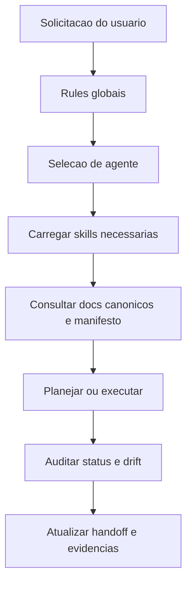
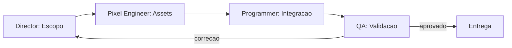

# SGDK Agent Framework Architecture

> Framework canonico de agentes para projetos `MegaDrive_DEV` hospedado em `tools/sgdk_wrapper/.agent`.

---

## Objetivo

Esta `.agent` existe para padronizar o comportamento de IAs que atuam em projetos SGDK do workspace.

Ela foi desenhada para:

- reforcar governanca documental e hierarquia de verdade
- proteger budgets e restricoes de hardware do Mega Drive
- manter a logica operacional no wrapper central
- separar claramente documentado, implementado, buildado, testado e placeholder
- reduzir deriva entre manifesto, codigo, documentacao e status real
- garantir cadeia de evidencia deterministica entre ROM gerada, emulador aberto e artefatos de QA

---

## Regra de hospedagem

- Fonte canonica: `tools/sgdk_wrapper/.agent`
- Materializacao local: `<projeto>/.agent`
- Politica de copia: apenas bootstrap quando a pasta local nao existir
- Politica de sobrescrita: **proibida por padrao**

Os wrappers centrais garantem o bootstrap automatico para projetos novos e antigos.

### Resiliencia de bootstrap

- Bootstrap ausente pode ser materializado automaticamente.
- Bootstrap presente mas sem `framework_manifest.json` nao deve ser tratado como saudavel por padrao.
- Divergencia entre copia local e fonte canonica deve promover o projeto a estado de `bootstrap_degradado` ate auditoria de drift.
- O wrapper deve preferir aviso honesto e modo degradado a assumir que a copia local ainda representa a verdade canonica.

---

## Estrutura

```text
.agent/
  ARCHITECTURE.md
  framework_manifest.json
  agents/
  rules/
  skills/
  workflows/
  scripts/
```

### Responsabilidades

- `rules/`: regras sempre ativas e nao negociaveis
- `agents/`: personas especializadas por dominio
- `skills/`: conhecimento reutilizavel e carregavel por contexto
- `workflows/`: runbooks operacionais
- `scripts/`: automacoes de status, auditoria e verificacao
- `framework_manifest.json`: versao canonica da `.agent`, fontes de status e artefatos obrigatorios

---

## Hierarquia de verdade SGDK

Quando houver conflito, a ordem recomendada e:

1. `doc/10-memory-bank.md`
2. `doc/11-gdd.md`
3. `doc/13-spec-cenas.md`
4. `doc/00-diretrizes-agente.md`
5. `doc/12-roteiro.md`
6. `doc/03-arquitetura.md`
7. `.mddev/project.json`
8. `README.md`

Se um documento de menor prioridade contradizer um superior, ele deve ser tratado como desatualizado.

---

## Modelo operacional



### Contrato de evidencia operacional

- Nenhuma validacao em emulador e confiavel sem vinculo explicito com a ROM testada.
- A cadeia minima de evidencia deve ser: build final -> identidade da ROM -> sessao do emulador -> captura dedicada -> consolidacao do report -> memoria operacional.
- Captura dedicada significa imagem da janela do emulador alvo ou artefato equivalente do proprio emulador; captura da area de trabalho inteira nao basta.
- Se qualquer build ou rebuild ocorrer depois da captura, a evidencia anterior passa a ser `stale` ate nova validacao.
- `validation_report.json` nao pode sobrescrever silenciosamente um estado mais forte de QA sem marcar regressao ou evidência obsoleta.
- O framework deve preferir estados honestos como `observado`, `capturado`, `stale` e `degradado` em vez de colapsar tudo em `ok` ou `nao_testado`.

### Pipeline de producao: Design -> Art -> Code -> QA

O framework suporta um ciclo completo de producao de estudio 16-bits, orquestrado pelo workflow `production-loop`:



- O `game-director-sgdk` define escopo e protege contra feature creep.
- O `mega-drive-pixel-engineer` projeta e audita assets dentro dos limites do VDP.
- Os programadores integram codigo, assets e audio com suporte do `build-wrapper-operator` e `hardware-budget-guardian`.
- O `qa-hardware-tester` valida a ROM em emuladores precisos e cobra teste em hardware real.
- Nenhum passo do pipeline pode ser pulado. Evidencia e obrigatoria em cada transicao.

---

## Agentes

### Core (governanca e operacao)

- `project-planner-sgdk`: descoberta, plano e enquadramento de escopo
- `governance-auditor`: hierarquia de verdade, gates, handoff e anti-deriva
- `hardware-budget-guardian`: VRAM, DMA, sprites, H-Int e riscos de cena
- `build-wrapper-operator`: wrappers, manifesto, layout, build policy e rastreabilidade

### Producao (pipeline de estudio)

- `game-director-sgdk`: Game Designer, Level Designer e Producer — define visao, protege escopo, orquestra pipeline
- `mega-drive-pixel-engineer`: Diretor de Arte Tecnico — projeta e audita assets visuais dentro dos limites do VDP
- `qa-hardware-tester`: Bug Hunter e Tester de Performance — valida ROM em emuladores precisos e hardware real

### Pipeline de Arte (3 cenarios)

- `art-pipeline-operator`: Operador do pipeline de arte — detecta cenario, executa conversao, apresenta opcoes de correcao
- `art-creator`: Criador de assets — gera arte com IA ou sourcia da web (CC0/CC-BY), coordena conversao

---

## Skills

### Governanca

- `truth-hierarchy-guard`
- `doc-sync-audit`

### Operacao

- `sgdk-build-wrapper-operator`
- `status-panel-maintainer`

### Hardware

- `megadrive-vdp-budget-analyst`

### Arquitetura

- `scene-state-architect`

### Arte

- `megadrive-pixel-strict-rules`: leis irrevogaveis da arte pixel (paleta 9-bits, grid 8x8, escala 1x, proibicoes absolutas)
- `art-asset-diagnostic`: diagnostica estado dos assets (/data, /res) e detecta cenario 1/2/3
- `art-conversion-pipeline`: pipeline de conversao — photo2sgdk, batch_resize_index, fix_transparency, spec JSON
- `art-creation-sourcing`: criacao via IA (prompts especializados) ou busca na web (CC0/CC-BY)

---

## Scripts de automacao

- `art_diagnostic.py`: diagnostico completo de assets de um projeto (exit 0/1/2 por cenario)
- `test_art_pipeline.py`: suite de 32 testes para validar pericia do pipeline de arte
- `project_status.py`: relatorio de status do projeto
- `doc_drift_audit.py`: auditoria de deriva documental

Os scripts devem usar `framework_manifest.json` como ancora para versao da `.agent`, comparacao com copias locais e fontes reais do status panel.

---

## Workflows

### Operacionais

- `build-validate`: build, rebuild e validacao operacional
- `handoff`: encerramento de sessao com evidencias
- `plan`: planejamento de trabalho multi-arquivo
- `status`: relatorio de estado sem ambiguidade

### Producao

- `production-loop`: ciclo completo de producao do estudio — Design -> Art -> Code -> QA -> Iteracao
- `art-onboarding`: pipeline de arte para os 3 cenarios — converter /data, diagnosticar /res, criar sem arte

---

## Painel de status

O framework assume um painel unico com, no minimo, estes eixos:

- `documentado`
- `implementado`
- `buildado`
- `testado_em_emulador`
- `validado_budget`
- `placeholder`
- `parcial`
- `futuro_arquitetural`
- `agent_bootstrapped`

`agent_bootstrapped` indica se o projeto ja possui a `.agent` local materializada a partir da fonte canonica.
O estado desses eixos deve ser derivado primeiro de `out/logs/validation_report.json`, `out/logs/runtime_metrics.json` e `out/logs/emulator_session.json` quando esses artefatos existirem; heuristicas de arquivo entram apenas como fallback honesto.

### Proveniencia minima do status

- `validation_report.json` deve apontar para a identidade da ROM validada, idealmente com caminho, timestamp, tamanho e hash.
- `emulator_session.json` deve registrar o ciclo de vida da sessao com estados como `started`, `captured` e `closed`.
- `testado_em_emulador` nao deve subir para verdadeiro se existir apenas `launch_status=started`.
- `runtime_capture_present` nao deve depender apenas da existencia do arquivo; ele exige evidencia realmente anexada ao report.
- `agent_bootstrapped` deve poder coexistir com um indicador de degradacao quando a copia local existir, mas estiver sem manifesto ou em drift.

---

## Integracao com wrappers

Os seguintes scripts do wrapper participam do bootstrap automatico da `.agent`:

- `build.bat`
- `build_inner.bat`
- `run.bat`
- `rebuild.bat`
- `clean.bat`
- `env.bat`
- `new_project.bat`

O bootstrap e centralizado em `ensure_project_agent.bat` + `ensure_project_agent.ps1`.

Eles devem evoluir para:

- diagnosticar drift de manifesto antes de declarar o bootstrap como confiavel
- expor claramente quando a copia local esta em modo degradado
- impedir que evidencias velhas de emulador parecam validas para ROMs novas

---

## Limites intencionais

Esta `.agent` nao deve:

- inventar API do SGDK
- autorizar features fora do GDD
- normalizar `float`, heap no loop ou DMA inseguro
- sobrescrever `.agent` local customizada sem ordem explicita
- mentir status de validacao sem evidencia operacional

---

## Evolucao esperada

Evolucoes futuras devem adicionar novos agentes e skills sem perder estes principios:

- modularidade
- auditabilidade
- explicabilidade
- aderencia ao hardware real
- centralizacao da operacao no wrapper
