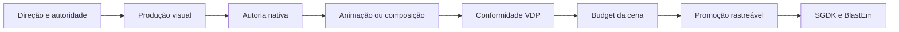
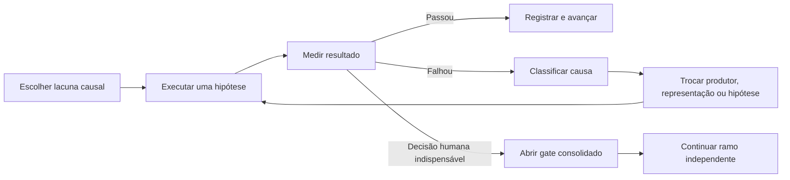

# Ciclo canônico de produção artística

Versão: 1.0  
Escopo: qualquer projeto SGDK do workspace  
Autoridade: este documento organiza o fluxo; as skills, contratos, validators e documentos do projeto continuam sendo as fontes executáveis de cada gate.

## Objetivo

Transformar direção de arte, model sheet ou imagem-conceito em assets nativos de Mega Drive, animações, tilemaps e cenas verificadas, sem confundir:

- imagem visualmente forte com pixel art nativa;
- conversão técnica com autoria artística;
- relatório aprovado com evidência rederivada;
- preview offline com asset integrado;
- build com prova em runtime;
- ambição AAA com claim AAA.

O fluxo é persistente: uma rota que falha encerra aquela hipótese, não o asset nem o projeto. O agente muda produtor, representação ou hipótese e continua nos ramos independentes. Só para diante de decisão humana de produto, autoridade/licença ausente, ausência real de produtor autorizado ou risco destrutivo fora do escopo.

## Princípio central

Nenhuma seta é apenas documental. Cada transição exige artefato, hash, medição e status compatível.

## Papéis que não podem ser fundidos

| Papel | Entrega | Não prova |
|---|---|---|
| Direção artística | intenção, câmera, referências, `must_preserve`, materiais e leitura | pixel nativo |
| Produtor visual | imagem externa ou gerada que resolve identidade, pose e composição | grid, paleta ou runtime |
| Tradutor/autoria nativa | decisões de pixel no canvas alvo | animação, budget ou aprovação humana |
| Conversor técnico | indexação, paleta, alpha, grid e relatórios | qualidade artística |
| Animador | key poses, fases, timing, arcos, continuidade e acting | integração SGDK |
| Curador visual | leitura em 1×, fidelidade, apelo, hierarquia e coerência | aprovação humana |
| Analista VDP | VRAM, DMA, tiles, metasprites e pressão de scanline | visual pass |
| Integrador SGDK | `.res`, código, build e execução | claim AAA sem evidência |

## Fase 0 — Verdade, cena e autoridade

Antes de gerar ou editar arte:

1. Ler `doc/10-memory-bank.md`, `doc/11-gdd.md`, `doc/13-spec-cenas.md`, direção de arte e contratos do projeto.
2. Confirmar câmera, papel de gameplay, pivô, contato, escala `locked` ou `provisional` e pior composição prevista.
3. Definir a fonte de identidade e registrar caminho, SHA-256, proveniência, licença e `must_preserve`.
4. Separar autoridade de identidade, referência de pose, referência de materiais e referência de movimento.
5. Marcar toda candidata reprovada como evidência negativa; ela não volta como fonte de pixels.

Sombra no chão, poeira, fumaça, nuvem, partículas, texto, checkerboard assado, oclusão ou membro cortado tornam a fonte inadequada para tradução mecânica. Ela pode permanecer `reference_only`, mas a produção pede model sheet ou frame limpo.

## Fase 1 — Diagnóstico e roteamento

Classificar o alvo antes de escolher ferramenta:

| Alvo | Owner principal | Rota |
|---|---|---|
| Personagem, inimigo, boss, objeto ou FX autoral | `native-sprite-production` | pose nativa, depois animação |
| Concept/render forte para sprite ou cena | `art-translation-to-vdp` | tradução interpretativa |
| Asset já nativo que só precisa de formato | `art-conversion-pipeline` | conversão técnica |
| Background/cena em profundidade | `multi-plane-composition` | BG_A, BG_B, WINDOW e foreground |
| Tilemap/Tiled | `tiled-hybrid-parallax-curator` | tiles, flips, mapas e oclusão |
| Julgamento estético | `visual-excellence-standards` | leitura 1× e CRT-aware |

Em raster high-res, executar `source-audit`. Se mais de uma rota mecânica for plausível, executar um shootout comparável: mesma fonte, matte, crop, canvas, pivô e escala. Filtros como Lanczos, Mitchell ou Catmull-Rom podem produzir underlays; nunca recebem o rótulo de autoria nativa.

Limite útil do shootout: `primary + challenger + control`, cada qual com hipótese realmente distinta. Recolor cosmético e near-duplicate não compram um gate humano.

## Fase 2 — Produção visual

Quando a identidade ou a pose ainda não estiver resolvida, usar um produtor visual autorizado antes da limpeza de pixels.

Regras:

- gerar uma pose ou problema semântico por vez;
- persistir imediatamente o arquivo bruto e seu hash;
- aceitar RGB/high-res como `visual_producer_output`, nunca como sprite final;
- verificar viewpoint, anatomia, silhueta, roupa, assinatura e continuidade antes de traduzir;
- não usar uma imagem reprovada como base de `img2img`, geração ou reparo;
- não transformar bloqueio de um produtor em nova rodada de infraestrutura.

Se o produtor bloquear a solicitação, são permitidas até três reformulações seguras e materialmente distintas. Persistindo o bloqueio, trocar para outra ferramenta visual autorizada ou autoria nativa real. Não contornar moderação e não fabricar um resultado por primitivas.

## Fase 3 — Autoria nativa

No canvas alvo e com escala travada, trabalhar nesta ordem:

1. silhueta e linha de ação;
2. shape blocks e proporções;
3. contorno/lineart nativo quando a linguagem visual pedir contorno;
4. color blocking por material;
5. topologia de materiais e fronteiras críticas;
6. sombra principal;
7. highlight mínimo e funcional;
8. limpeza de clusters, jaggies, tangentes e matte.

Lineart não é obrigatória para todo estilo, mas nunca pode ser falsificada por threshold, máscara preenchida, SVG procedural ou imagem redimensionada. Quando o contrato declarar `lineart_blocking_1px`, ela deve ser um artefato independente, nativo e verificável.

Prioridade visual:

1. leitura da silhueta e da ação;
2. identidade e assinatura;
3. rosto/direção do olhar e extremidades;
4. separação de materiais;
5. volume e iluminação;
6. economia de cor e tiles.

Budget não autoriza destruir identidade. Se a candidata ficar genérica ou ilegível em 1×, ela falha visualmente ainda que seja P/4bpp, use 15 cores e tenha poucos tiles.

## Fase 4 — Animação

Uma pose aprovada inicia a animação; uma sheet completa nunca é o primeiro experimento.

Ordem:

1. contrato da ação e perfil de movimento canônico;
2. key poses independentes vinculadas por SHA;
3. extremos, contato, passing/breakdown e recuperação;
4. inbetweens apenas após os extremos passarem;
5. pivô, contato, arcos, volume e viewpoint consistentes;
6. uma ação por strip;
7. timing/holds em VBlank;
8. preview derivado pixel a pixel do strip;
9. avaliação dos 12 princípios por ação e com evidência específica;
10. relatório agregado sem elevar claim por média.

Os validators devem reprovar permanentemente:

- fragmento de célula vizinha, mesmo sob política `fixed-cell`;
- silhueta preenchida ou rasterização automática declarada como lineart 1 px;
- frames reordenados e renomeados como ações diferentes;
- viewpoint incompatível com a ação;
- contato declarado em pixel transparente;
- preview ou timing divergente do contrato;
- paleta por frame sem autorização;
- decomposição de hardware contraditória entre relatórios;
- `visual_pass=true` quando fidelidade, direção, revisão cega ou princípios estiverem pendentes/reprovados;
- decisão humana sem vínculo de caminho, SHA e ação.

## Fase 5 — Conformidade técnica

O conversor recebe uma candidata visual; ele não decide desenho.

Para sprites indexados:

- PNG `P` em 4 bpp;
- até 15 cores visíveis mais índice 0 transparente;
- alpha binário e sem halo RGB oculto;
- cores no grid aceito pelo Mega Drive/ResComp;
- dimensões, células, gutters e pivô coerentes;
- relatório rederivado do PNG, nunca aceito apenas por metadata.

Operações determinísticas usam CLI/headless. GIMP visual e automação de ponteiro não são rota de conversão, indexação, recorte ou exportação. GIMP batch pode ser usado apenas quando oferecer operação necessária e export determinístico; Pillow, ImageMagick ou ferramentas canônicas são preferíveis para tarefas mecânicas simples.

## Fase 6 — Budget VDP e composição real

Medir o asset no pior cenário previsto e no degrau seguinte:

- tiles brutos e únicos;
- VRAM simultânea;
- bytes de DMA no pior frame;
- células/metasprites;
- sprites e pixels por scanline;
- paletas simultâneas;
- interação com HUD, inimigos, FX e áudio.

H40 impõe simultaneamente 20 sprites e 320 pixels por scanline; H32, 16 e 256. `planning_budget` não vira `validated_budget` sem integração e medição do runtime correspondente.

## Fase 7 — Gate visual e humano

O pacote de decisão deve derivar do mesmo hash e incluir:

- 1× nativo;
- 2× e 3×;
- nearest 8×;
- silhueta;
- fundos claro, escuro e chroma;
- composição 320×224;
- crops de rosto, assinatura, mãos/pés ou regiões críticas;
- comparação com autoridade e incumbent;
- deltas, linhagem, limitações e teto de claim.

O agente pode manter revisão humana `pending` e continuar ramos independentes em staging. Não pode registrar `human_decision_valid`, `visual_pass` ou `ready_for_res` em nome do humano.

## Fase 8 — Promoção, SGDK e runtime

Promoção para `res/` exige simultaneamente:

- fonte e lineage válidos;
- pixel gate;
- visual gate;
- escala e pivô aprovados;
- budget aplicável;
- decisão humana vinculada ao hash;
- builder/spec rastreável;
- proveniência declarada.

Depois da promoção:

1. atualizar `resources.res` sem editar arte durante o build;
2. buildar pela fonte única `tools/sgdk_wrapper/`;
3. medir VRAM, DMA, scanline, timing e áudio na cena pesada;
4. executar no BlastEm;
5. vincular screenshot, SRAM/VDP dump quando aplicável e logs ao hash da ROM;
6. atualizar memory bank e changelog.

Sem BlastEm, o máximo é candidato de integração. Não existe claim de entrega AAA.

## Persistência causal e limites de parada

Paradas legítimas:

- decisão humana que altera identidade, direção, escala, câmera, produto ou promoção;
- licença/autoridade ausente;
- todas as rotas de produção visual autorizadas falharam com evidência;
- ação destrutiva ou externa não autorizada;
- risco real aos arquivos protegidos;
- blocker de hardware sem alternativa dentro do GDD.

Não são motivos de parada: PNG RGB/high-res, falta de GIMP GUI, uma rota de filtro ruim, falha de quantização, relatório incompleto ou candidato visualmente reprovado. Esses casos pedem reclassificação e nova hipótese.

## Status e tetos de claim

| Marco | Teto máximo |
|---|---|
| conceito/model sheet persistido | `visual_source` |
| geração high-res | `visual_producer_output` |
| downscale/quantização/rota mecânica | `technical_candidate` |
| pixels decididos no grid | `native_candidate` |
| key poses e strip sem humano/runtime | `native_animation_candidate` |
| todos os gates + humano | `ready_for_res` |
| integrado, sem BlastEm | `runtime_candidate` |
| ROM observada e eixos fechados | claim conforme evidência; AAA só com gate completo |

## Entradas canônicas

- Produção de sprites: `tools/sgdk_wrapper/.agent/skills/art/native-sprite-production/SKILL.md`
- Loop operacional: `tools/sgdk_wrapper/.agent/workflows/native-sprite-production-loop.md`
- Tradução: `tools/sgdk_wrapper/.agent/skills/art/art-translation-to-vdp/SKILL.md`
- Animação: `tools/sgdk_wrapper/.agent/skills/art/sprite-animation/SKILL.md`
- Excelência visual: `tools/sgdk_wrapper/.agent/skills/art/visual-excellence-standards/SKILL.md`
- Pixel strict: `tools/sgdk_wrapper/.agent/skills/art/megadrive-pixel-strict-rules/SKILL.md`
- Budget: `tools/sgdk_wrapper/.agent/skills/hardware/megadrive-vdp-budget-analyst/SKILL.md`
- Governança de claim: `tools/sgdk_wrapper/.agent/skills/governance/aaa-pipeline-guardian/SKILL.md`
- Evidência: `tools/sgdk_wrapper/.agent/skills/operation/emulator-vdp-evidence-curator/SKILL.md`

