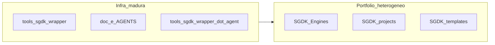

# Compreensão do MegaDrive_DEV e estágio honesto de desenvolvimento

**Escopo:** visão consolidada do repositório para humanos e agentes.  
**Última consolidação:** 2026-04-11  

Documento derivado do plano de compreensão do workspace; alinha-se à hierarquia de verdade em [../AGENTS.md](../AGENTS.md) e ao estado operacional em [06_AI_MEMORY_BANK.md](06_AI_MEMORY_BANK.md).

---

## O que o projeto se propõe a ser

Pelo manifesto público em [../README.md](../README.md) e pela governança em [../AGENTS.md](../AGENTS.md), o repositório **não é um único produto comercial “jogo X”**, e sim um **workspace de desenvolvimento homebrew** para Sega Mega Drive / Genesis com **SGDK 2.11**, com estes pilares:

- **Toolchain e build centralizados:** scripts em [../tools/sgdk_wrapper/](../tools/sgdk_wrapper/) (`env.bat`, `build.bat`, `clean.bat`, `run.bat`) como fonte única de lógica de build; os projetos delegam por caminhos relativos.
- **Template “elite” e estrutura canónica:** [../SGDK_templates/base-elite/](../SGDK_templates/base-elite/), manifesto `.mddev/project.json`, documentação em [CANONICAL_WORKTREE.md](CANONICAL_WORKTREE.md).
- **Biblioteca pedagógica e acervo:** dezenas de engines e exemplos em [../SGDK_Engines/](../SGDK_Engines/), laboratórios em [../SGDK_projects/](../SGDK_projects/) (incluindo `_laboratório/`), material arquivado em `archives/`.
- **Rigor de produção orientado a hardware real:** regras explícitas (evitar `float`/`double` no caminho quente, sem `malloc` no loop, uploads sensíveis ao VDP alinhados ao VBlank conforme [../AGENTS.md](../AGENTS.md), validação de recursos, gate **“se não rodou no emulador, não existe”** no mesmo documento).
- **Framework para agentes de IA:** `.agent` canónico em `tools/sgdk_wrapper/.agent/` com skills, workflows e casos de biblioteca; ponte [../.agents/README.md](../.agents/README.md) para descoberta de skills compatível com Codex.

Em uma frase: **laboratório + fábrica + manual de excelência** para SGDK 2.11 no Windows, com jogos e engines como **unidades dentro** do workspace.

---

## Estágio honesto e real (sem romantizar)

### 1) Infraestrutura, documentação e processo: alto nível

- O manifesto público do workspace está em [../README.md](../README.md); o índice da pasta `doc/` está em [README.md](README.md). O [06_AI_MEMORY_BANK.md](06_AI_MEMORY_BANK.md) descreve decisões recentes, matrizes de maestria 16-bit, protocolos de canonização e registry de padrões de engines — isto é **maturidade de engenharia e governança**, não equivale por si só a “jogo pronto para venda”.
- O memory bank global referencia **“13/13 projetos compiláveis”** no contexto de uma validação específica — deve ler-se como **um conjunto sob controlo**, não como “toda a árvore do repositório é um produto acabado”.

### 2) Catálogo em `SGDK_Engines`: bifurcado de propósito

O [../SGDK_Engines/README.md](../SGDK_Engines/README.md) documenta explicitamente:

- **Build validado:** entradas que **geram ROM** com sucesso (exemplos, templates, jogos simples).
- **Pendente:** entradas com **falhas concretas** (símbolos duplicados, recursos ausentes, APIs deprecadas, incompatibilidade de `MapDefinition`, etc.).

Conclusão: o estágio aqui é **acervo integrado com triagem de migração SGDK 2.11** — parte sólida para estudo e base, parte ainda **quebrada ou incompleta** até correção pontual.

### 3) Jogos e laboratórios autorais: desenho e código à frente da evidência de produto

Dois exemplos canónicos nos próprios `10-memory-bank.md` dos projetos:

- [../SGDK_projects/BENCHMARK_VISUAL_LAB/doc/10-memory-bank.md](../SGDK_projects/BENCHMARK_VISUAL_LAB/doc/10-memory-bank.md): estado **`implementado`**, com foco em prova em ROM e lições de budget de VRAM — **laboratório técnico em evolução**, não “feature complete” no sentido de produto comercial.
- [../SGDK_projects/_laboratório/Pequeno Principe Cronicas das Estrelas [VER.002] [SGDK 211] [GEN] [GAME] [AVENTURA]/doc/10-memory-bank.md](../SGDK_projects/_laborat%C3%B3rio/Pequeno%20Principe%20Cronicas%20das%20Estrelas%20%5BVER.002%5D%20%5BSGDK%20211%5D%20%5BGEN%5D%20%5BGAME%5D%20%5BAVENTURA%5D/doc/10-memory-bank.md): arquitetura e ficheiros de código criados; o próprio memory bank assinala **`buildado` e `testado_em_emulador` como pendentes** e lacunas de arte — típico de **pré-produção ou vertical slice não fechado**.

### 4) Sinal externo versus critério interno

- O badge “build passing” no [../README.md](../README.md) aponta para um URL genérico; **não substitui** o critério interno de evidência em emulador descrito no [../AGENTS.md](../AGENTS.md).

---

## Síntese em uma linha

**Proposta:** workspace profissional para SGDK 2.11 com wrappers, templates elite, acervo de engines e disciplina de QA e documentação.

**Estágio real:** **infraestrutura e metodologia muito maduras**; **portfólio de código de terceiros ou herdado em estado misto (validado versus pendente)**; **jogos autorais em fases de implementação e laboratório visual**, com **build e validação em emulador ainda como trabalho explícito** nos projetos em foco — coerente com o vocabulário de status em [../AGENTS.md](../AGENTS.md) (`implementado` ≠ `testado_em_emulador`).

---

## Referências cruzadas

| Tema | Onde aprofundar |
|------|-----------------|
| Regras e gate de entrega | [../AGENTS.md](../AGENTS.md) |
| Estado e decisões recentes do workspace | [06_AI_MEMORY_BANK.md](06_AI_MEMORY_BANK.md) |
| Lista validada versus pendente em engines | [../SGDK_Engines/README.md](../SGDK_Engines/README.md) |
| Worktree e manifesto | [CANONICAL_WORKTREE.md](CANONICAL_WORKTREE.md) |
