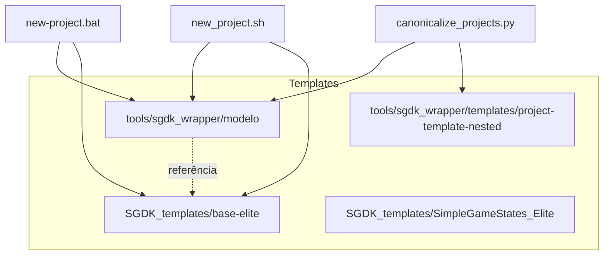

# Hierarquia de Templates

Este documento descreve o papel de cada template no workspace MegaDrive_DEV e evita ambiguidades.

## Visão Geral

## Papel de Cada Template

| Caminho | Papel | Uso |
|---------|-------|-----|
| `tools/sgdk_wrapper/modelo/` | Template primário efetivo | Usado por `new_project.bat` e `new_project.sh` para criar novos projetos; base editável com docs, wrappers e bootstrap alinhados ao wrapper central |
| `SGDK_templates/base-elite/` | Fallback e referência ELITE | Fallback quando `modelo/` não estiver disponível e referência de qualidade para direção estrutural e visual |
| `SGDK_templates/SimpleGameStates_Elite/` | Variante com estados | Template com máquina de estados de jogo; variante do base-elite |
| `tools/sgdk_wrapper/templates/project-template-nested/` | Fixture interno | Usado **apenas** por `canonicalize_projects.py` para README/layout nested; não usar diretamente |

## Regras

- **Novos projetos:** Use `new-project.bat` ou `tools/sgdk_wrapper/new_project.sh`; ambos priorizam `tools/sgdk_wrapper/modelo` e caem em `SGDK_templates/base-elite` apenas como fallback.
- **Referência de qualidade:** Consulte `SGDK_templates/base-elite/` para padrões ELITE.
- **Template efetivo:** Não trate o caminho legado de template como fonte vigente; ele não faz parte da topologia atual do workspace.
- **Fixture nested:** Não modifique nem use `project-template-nested/` fora do fluxo de canonicalização.

## Referências

- [tools/sgdk_wrapper/MODELO.md](../tools/sgdk_wrapper/MODELO.md)
- [SGDK_templates/README.md](../SGDK_templates/README.md)
- [CLAUDE.md](../CLAUDE.md) — Directory Layout
