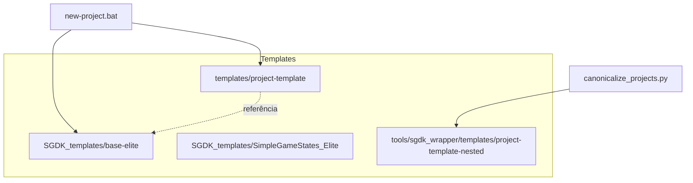

# Hierarquia de Templates

Este documento descreve o papel de cada template no workspace MegaDrive_DEV e evita ambiguidades.

## Visão Geral

## Papel de Cada Template

| Caminho | Papel | Uso |
|---------|-------|-----|
| `templates/project-template/` | Template canônico mínimo | Usado por `new-project.bat` para criar novos projetos; esqueleto básico com src/, res/, inc/, wrappers de build |
| `SGDK_templates/base-elite/` | Template ELITE Golden | Template completo obrigatório para novos projetos; referência de qualidade e padrões |
| `SGDK_templates/SimpleGameStates_Elite/` | Variante com estados | Template com máquina de estados de jogo; variante do base-elite |
| `tools/sgdk_wrapper/templates/project-template-nested/` | Fixture interno | Usado **apenas** por `canonicalize_projects.py`; não usar diretamente |

## Regras

- **Novos projetos:** Use `new-project.bat` que delega a `tools/sgdk_wrapper/new_project.bat`.
- **Referência de qualidade:** Consulte `SGDK_templates/base-elite/` para padrões ELITE.
- **Fixture nested:** Não modifique nem use `project-template-nested/` fora do fluxo de canonicalização.

## Referências

- [templates/README.md](../templates/README.md)
- [SGDK_templates/README.md](../SGDK_templates/README.md)
- [CLAUDE.md](../CLAUDE.md) — Directory Layout
