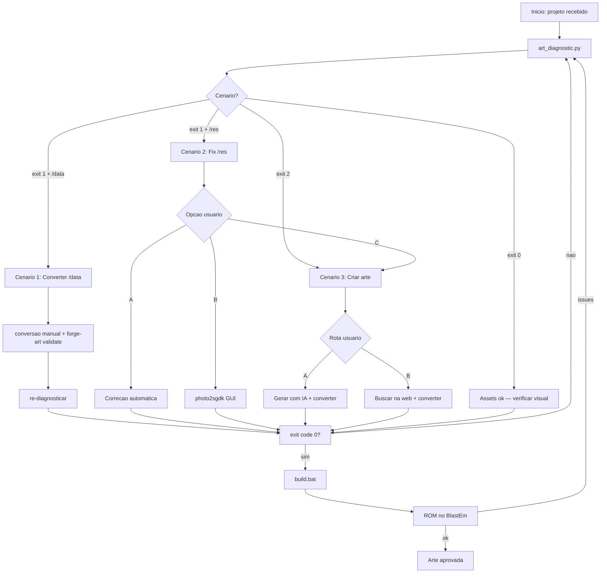

# Workflow: Art Onboarding — 3 Cenarios

Use este workflow quando iniciar qualquer trabalho de arte em um projeto SGDK, ou quando receber um projeto com estado de arte desconhecido.

**Agente responsavel:** `art-pipeline-operator` (coordena), `art-creator` (cenario 3)

---

## Passo 0 — Diagnostico inicial (SEMPRE)

```bash
python tools/sgdk_wrapper/art_diagnostic.py \
  --project "<caminho_do_projeto>" \
  --output doc/art_diagnostic.json
```

Interpretar resultado e ir para o cenario correspondente.

---

## CENARIO 1 — `/data` existe, precisa conversao

**Detectado quando:** exit code 1 + diretorio `/data` com PNGs + issues `NOT_INDEXED` ou `DIM_NOT_MULTIPLE_8`

### Gate de roteamento antes da conversao

Antes de cair no lote generico, verificar se o projeto ja tem uma rota curada:

- builder dedicado em `tools/image-tools/build_*.py`
- `doc/source_cases/**/case_manifest.json`
- `reports/*animation_manifest.json`
- staging aprovado em `doc/12-roteiro.md` ou `doc/13-spec-cenas.md`

Se existir:

- usar primeiro o builder curado do projeto
- NAO usar `batch_resize_index.py` nem `fix_png_transparency_final.py`: aposentados
  em 2026-08-30 (downscale Lanczos + saida RGBA destruiam o index 0). Ambos
  falham fechado de proposito. `photo2sgdk` so como acabamento, nunca como rota
- nao abrir OCR, thumbnails ou crop manual para redescobrir pose/camada que o contrato ja fixou

Exemplo canonico:

- `BENCHMARK_VISUAL_LAB_V2` Cena 1: `python tools/image-tools/build_bvl_v2_scene1_assets.py`

### Fluxo

```
1. Revisar relatorio de issues em doc/art_diagnostic.json
2. Criar spec JSON (se nao existir):
   tools/image-tools/specs/<projeto>_spec.json

3. Classificar a fonte ANTES de converter (a rota depende disso):
   - pixel nativo / ja indexado  -> rota A (technical_conversion)
   - high-res de identidade      -> rota B (assisted_native_translation):
     NAO se converte por codigo. Registre o encaminhamento e pare:
     python3 -m forge_art translate --asset-id <id> --source <png> --out <json>

4. Conversao (rota A):
   ATENCAO: `forge-art convert` ainda NAO existe. Ate existir, a conversao e
   manual, respeitando: PNG modo P, PLTE <= 16, <= 15 cores visiveis, index 0
   conforme o papel declarado, alpha binario, NEAREST apenas.
   Interpolado (Lanczos/bilinear/bicubico) e proibido em caminho de pixel.

5. MEDIR o resultado (isto e obrigatorio, nao opcional):
   python3 -m forge_art validate <png> --index0-role transparent0
   # exit 0 = technical_candidate. NAO e aprovacao visual.

6. Re-diagnosticar para confirmar:
   python tools/sgdk_wrapper/art_diagnostic.py --project "<projeto>"
   # Esperado: exit code 0

7. Validar com SGDK:
   powershell -File tools\sgdk_wrapper\validate_resources.ps1

8. Build de teste:
   call build.bat

9. Verificar ROM no emulador (BlastEm obrigatorio):
   call run.bat
```

### Criterio de saida do Cenario 1

```
✅ art_diagnostic.py exit code = 0
✅ validate_resources.ps1 sem erros
✅ Todos os PNGs em modo P (indexado)
✅ Dimensoes multiplas de 8
✅ Max 15 cores por paleta
✅ build.bat sucesso
✅ ROM abre sem artefatos visuais
```

---

## CENARIO 2 — `/res` existe, assets inadequados

**Detectado quando:** exit code 1 + assets em `/res` com issues criticos ou de qualidade

### Fluxo

```
1. Gerar relatorio detalhado por asset
2. Classificar issues:
   - CRITICOS (NOT_INDEXED, DIM_NOT_MULTIPLE_8, TOO_MANY_COLORS): bloqueantes
   - AVISOS (COLORS_NOT_9BIT, NO_MAGENTA_TRANSPARENT): degradam qualidade

3. Apresentar 3 opcoes ao usuario:
```

**Opcao A — Normalizacao de PNG ja indexado:**
```bash
# fix_png_transparency_final.py foi aposentado: compunha sobre preto e
# destruia o index 0. O normalizador atual so aceita entrada JA indexada.
# Assinatura: <papel-do-index-0> seguido dos ARQUIVOS (nao aceita diretorio).
python tools/image-tools/normalize_indexed_sgdk_png.py transparent0 "<projeto>/res"/*.png

# Depois normalizar, MEDIR (obrigatorio):
python3 -m forge_art validate "<projeto>/res/<asset>.png" --index0-role transparent0

# Auto-fix sprite.res
powershell -File tools\sgdk_wrapper\autofix_sprite_res.ps1

# Validar
python tools/sgdk_wrapper/art_diagnostic.py --project "<projeto>"
```

**Opcao B — Reconversao manual via photo2sgdk:**
```bash
# Abrir GUI para ajuste preciso
call tools\photo2sgdk\run.bat
# Para cada asset com issue critico:
# 1. Carregar o PNG
# 2. Ajustar paleta para <= 15 cores no grid 9-bits
# 3. Exportar indexado para res/
```

**Opcao C — Substituir por novos assets:**
```bash
# Ir para Cenario 3 para criar/buscar novos assets
# (manter backup dos originais em data/raw/)
```

```
4. Executar opcao escolhida pelo usuario
5. Re-diagnosticar e validar
6. Build de teste + ROM no emulador
```

### Criterio de saida do Cenario 2

```
✅ Todos os issues criticos resolvidos
✅ art_diagnostic.py exit code = 0
✅ Usuario notificado sobre avisos restantes (se houver)
✅ Build e ROM funcionais
```

---

## CENARIO 3 — Sem arte

**Detectado quando:** exit code 2 (nenhum asset encontrado)

### Fluxo

```
1. Emitir context_pack_manifest
2. Definir concept_art_direction_brief, master_style_manifest e art_generation_brief
3. Listar assets necessarios com dimensoes
4. Classificar a rota pelo papel do asset e pelas ferramentas disponiveis
5. Abrir gate humano somente para licenca, identidade ou mudanca de produto;
   escolha tecnica reversivel segue pelo loop causal
```

### ROTA A — Geracao com IA

```
6A. Gerar prompts especializados por asset herdando master_style_manifest
7A. Gerar imagens (ferramenta de IA escolhida)
8A. Salvar brutos em data/raw_ai/ e fontes aceitas em data/source_art/
9A. Registrar asset_lineage_record para cada resultado
10A. Para sprite/sheet/objeto/FX autoral, executar native-sprite-production
11A. Para conversao apenas tecnica, usar forge-art em staging
12A. Validar pixel, visual, escala e budget como gates independentes
13A. Promover somente depois de aprovacao e entao build + BlastEm
```

### ROTA B — Busca na Web

```
6B. Buscar em opengameart.org, itch.io com queries especializadas
7B. Avaliar cada asset (licenca, dimensoes, estilo, cores)
8B. Baixar selecionados para data/raw/
9B. Documentar licencas em data/ASSETS_CREDITS.md
10B. Registrar asset_lineage_record para cada fonte candidata
11B. Cortar sprite sheets se necessario (ImageMagick)
12B. Classificar como nativo, conversao tecnica ou traducao interpretativa
13B. Para sprite/sheet/objeto/FX autoral, executar native-sprite-production
14B. Validar lineage, pixel, visual, escala e budget
15B. Promover somente depois de aprovacao e entao build + BlastEm
```

### Criterio de saida do Cenario 3

Novos gates de orquestracao:

- `context_pack_manifest` emitido antes de prompt/download
- `concept_art_direction_brief` declara metodo de escolha, nove eixos visuais e cinco gates
- `master_style_manifest` documentado
- `asset_lineage_record` para todo asset bruto aceito ou rejeitado

```
✅ Bible artistica documentada
✅ Concept art direction brief documentado
✅ Creditos de assets documentados (se Rota B)
✅ Spec JSON criado para todos os assets
✅ art_diagnostic.py exit code = 0
✅ Build e ROM funcionais
✅ Assets aprovados visualmente pelo usuario
```

---

## Diagrama resumido



---

## Handoff de sessao (arte)

Ao encerrar sessao de trabalho de arte:

1. Atualizar `doc/art_diagnostic.json` com ultimo estado
2. Registrar quais assets estao `convertido`, `aguarda_aprovacao` ou `pendente`
3. Documentar decisoes de paleta (por que determinada cor foi escolhida)
4. Se usou Rota B, verificar que ASSETS_CREDITS.md esta completo
5. Se build falhou, registrar o erro exato e o asset causador
