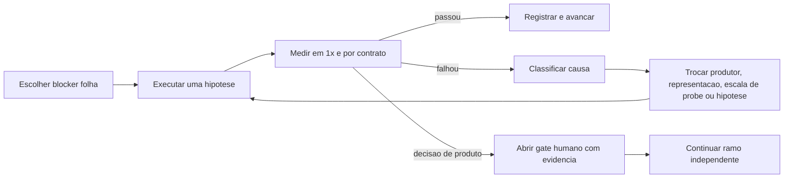

# Workflow: Native Sprite Production Loop

Use para qualquer projeto SGDK que precise produzir personagem, inimigo, boss, objeto ou FX autoral a partir de concept, arte de IA ou raster high-res.

## Objetivo

Chegar a um asset nativo, legivel e integrado sem permitir que concept, fake pixel art, scale probe ou conversao tecnica sejam promovidos por exaustao.

## Estado canonico

Mantenha `native_sprite_production_record.json` no projeto e valide com:

```bash
python3 tools/sgdk_wrapper/validate_native_sprite_production.py \
  --project-root "<projeto>" \
  --record "<projeto>/doc/art/<asset>/native_sprite_production_record.json"
```

O record aponta para os artefatos; nao os substitui.

## Ciclo

### 1. Verdade e contexto

- carregar GDD, spec de cena, camera, memory bank e feedback visual
- congelar `visual_source_of_truth`, lineage, licenca e `must_preserve`
- classificar a fonte e proibir sheets reprovadas como geracao futura
- aplicar `forge-art source-audit`; fonte contaminada por sombra/FX/editorial
  permanece reference-only e exige uma fonte limpa antes de traduzir

### 2. Escala e gameplay

- declarar `locked` ou `provisional`
- registrar bbox, pivot, ground line, FOV, hitbox, workload e assimetria
- escala travada nao muda durante key poses

### 3. Produtor visual

- gerar uma pose semantica por vez
- persistir cada resultado antes de usa-lo
- medir arquivo imediatamente
- RGB/high-res, checkerboard assado ou microcores => `visual_source`
- nao abrir editor GUI por ponteiro para operacao deterministica

Antes da autoria nativa cara, quando a entrada for raster high-res:

- executar `forge-art route-shootout` com o mesmo source, matte, target, anchor
  e canvas para todas as rotas aplicaveis;
- usar o prior historico apenas para ordenar/encurtar uma classe ja conhecida;
- selecionar no maximo primary + challenger + control como underlays;
- registrar o handoff como `native_reauthoring_over_<route>_guide`;
- bloquear alternativas sem causalidade, near-duplicates e candidatos que ja
  falham silhueta/identidade. O painel nao cria aprovacao automatica.

### 4. Construcao nativa

Executar na ordem:

1. silhueta e massa
2. `lineart_blocking_1px`
3. color blocking por material
4. `material_topology_gate`: propriedade de cada pixel e fronteiras entre materiais
5. sombra principal
6. highlights minimos
7. limpeza de contorno e clusters

Nao avance para cor se lineart falhar; nao avance para sheet se uma pose falhar.
Nao avance para sombra se roupa, pele e acessorios ainda se contaminarem. O mapa
anatomico e o mapa de materiais sao artefatos distintos.

### 5. Probe de escala

- `forge-art convert` pode produzir controle `basic` em staging
- probe nunca e promotable
- uma candidata convertida pode seguir como `assisted_native_translation`, mas
  somente depois de revisao independente do mesmo hash; o sucesso do job nao e
  o gate visual
- revisar o resultado em 1x antes de elogiar
- se a escala for `locked`, falha volta para autoria direta
- se for `provisional`, compare ate tres escalas com a mesma entrada
- alternativa que muda camera/gameplay exige budget e gate humano

### 6. Contrato tecnico

- PNG P/4bpp, PLTE <=16, 15 cores visiveis, index 0 e alpha binario
- RGB no grid aceito pelo oraculo ResComp
- dimensoes multiplas de 8 e bbox/pivot coerentes
- `pixel_contract` rederivado; relatorio fornecido nao e confiado sozinho

### 7. Gate visual nativo

Exigir quatro evidencias do mesmo hash:

- 1x nativo
- ampliacao nearest
- fundo claro
- fundo escuro

O validador rederiva nearest e composicoes a partir do candidato. `native_1x`
deve ser o mesmo arquivo byte a byte, e o registro de aprovacao humana deve
citar o SHA-256 do candidato; quatro paths quaisquer nao satisfazem o gate.

Julgar silhueta, rosto, maos, pes, contato, feature assinatura, material e contorno. `technical_pass_visual_fail` volta para P1/P4 com causa classificada.

Para candidatos `schema_version=1.4.0`, o validador tambem rederiva o
`material_region_contract`: o mapa deve cobrir exatamente a silhueta, cada
indice visivel precisa pertencer ao material daquela coordenada ou ao outline
compartilhado, e fronteiras criticas declaradas precisam existir. Falhas
`material_palette_leakage`, `material_palette_role_overlap`,
`material_boundary_overlay_not_derived` e `critical_material_boundary_missing`
voltam ao color blocking por patch explicito; nao autorizam regeneracao integral.

### 8. Budget antes da animacao

- metasprite e pior scanline
- tiles unicos por pose/frame
- residencia simultanea e janela ativa
- bytes DMA no pior frame
- paleta compartilhada e Shadow/Highlight quando aplicavel

### 9. Producao de movimento

- key poses primeiro
- lineart nativa aprovada por estado, vinculada por SHA e acao em
  `animation_strip_contract` v2 antes de gerar inbetweens
- um unico guia causal e uma unica gramatica visual por personagem; nunca
  escolher filtro, matte, escala ou produtor independentemente por frame
- uma acao por strip
- pivot, foot contact, motion phases e timing
- preview animado do output convertido
- nao montar atlas monolitico como unidade de curadoria

### 10. SGDK e evidencia

- promover apenas com pixel + visual + escala + budget + humano
- atualizar `.res` pelo builder/spec rastreavel
- build, BlastEm, captura e VDP dump vinculados ao mesmo hash da ROM
- atualizar memory bank e changelog

## Loop de falha



Falhas de dimensao, indexacao, grid, alpha e densidade nao sao decisoes humanas. Mudanca de escala que altera FOV/hitbox/workload e decisao de produto.

## Saidas por marco

| Marco | Status maximo |
|---|---|
| fonte forte persistida | `visual_source_ready` |
| probe 15 cores | `technical_candidate` |
| nativa pixel-strict | `native_candidate` |
| nativa visual + budget | `ready_for_animation` |
| humano + lineage + `.res` elegivel | `ready_for_res` |
| ROM observada | `runtime_candidate` |

Nenhum marco isolado sustenta AAA.
