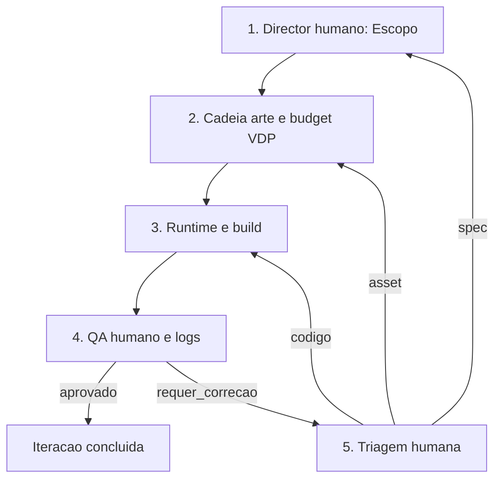

# Workflow: Production Loop

Use este fluxo para o pipeline completo de producao de uma iteracao: do design a entrega validada.

Cada passo tem **skills reais** (em `tools/sgdk_wrapper/.agent/skills/`) ou **papel humano** explicito. A ordem canonica da jornada cena AAA esta em `workflows/aaa-scene-pipeline.md` e em `pipelines/aaa_scene_v1.json`. Nenhum passo pode ser pulado.

---

## Pipeline: Design -> Art -> Code -> QA -> Iteracao

### 1. Escopo e mecanica (papel humano: Director)

**Nao ha skill `game-director-sgdk` no repo** — tratar como direcao de produto humana ou brief escrito.

- Consultar GDD (`doc/11-gdd.md`) e spec de cenas (`doc/13-spec-cenas.md`).
- Delimitar escopo da iteracao: cena, mecanica ou feature.
- Decompor em tarefas com criterios de aceitacao.
- **Criterio de saida**: briefing com escopo, assets necessarios e criterios documentados.

### 2. Arte e budget VDP (skills: diagnostico -> composicao -> traducao -> excelencia -> budget)

**Nao ha skill `mega-drive-pixel-engineer`** — o trabalho e coberto por esta cadeia (invocar na ordem de `aaa_scene_v1.json` quando a iteracao for cena/visual):

| Etapa | Skill (pasta sob `skills/`) |
|-------|-----------------------------|
| Classificar estado dos assets | `art/art-asset-diagnostic` |
| Planos, parallax, contrato de planos | `art/multi-plane-composition` |
| Traducao interpretativa para VDP | `art/art-translation-to-vdp` |
| Julgamento estetico AAA | `art/visual-excellence-standards` |
| Tiles, VRAM, DMA, sprites | `hardware/megadrive-vdp-budget-analyst` |

Regras pixel: `art/megadrive-pixel-strict-rules`. Conversao tecnica sem reinterpretacao: `art/art-conversion-pipeline`.

- **Criterio de saida**: assets aprovados ou aprovados com ajustes; `res/resources.res` alinhado ao budget; decisao explicita `cabe` / `cabe com recuo` / `nao cabe` documentada.

### 3. Integracao runtime (skills de codigo e wrapper)

**Skills**: `code/sgdk-runtime-coder`, `architecture/scene-state-architect`, `operation/sgdk-build-wrapper-operator`, `hardware/megadrive-vdp-budget-analyst` (revalidar se a cena mudar).

- Antes do build: `tools/sgdk_wrapper/preflight_host.ps1` (host Java/Python/ImageMagick/SGDK).
- Build via wrapper do projeto; ver `workflows/build-validate.md`.
- **Criterio de saida**: compila sem erros; ROM em `out/rom.bin`; entradas `.res` coerentes com o plano de arte.

### 4. Validacao ROM (papel humano: QA + artefactos obrigatorios)

**Nao ha skill `qa-hardware-tester`** — QA e humano assistido por scripts e relatorios.

- `rebuild.bat` quando o objetivo for reprodutibilidade.
- Analisar `out/logs/validation_report.json` (gerado por `validate_resources.ps1` no fluxo de build quando configurado).
- BlastEm obrigatorio para gate de entrega; BizHawk opcional para telemetria.
- **Criterio de saida**: eixos em `build-validate.md` preenchidos; evidencia em `out/logs/` (ex.: `emulator_session.json`, capturas); relatorio coerente com a ROM.

### 5. Iteracao e correcao

**Triagem**: papel humano (Director). **Correcao**: voltar as skills da etapa afetada (arte: secao 2; codigo: secao 3).

- **Criterio de saida**: `aprovado_para_iteracao` ou `validado` com prova em hardware/emulador alvo.

---

## Regras do loop

- **Nenhum passo pode ser pulado.**
- **Feature creep bloqueado** no passo 1.
- **Assets nao validados nao entram no build** sem excecao documentada.
- **ROM nao testada nao e entregue.**
- **Handoff explicito** entre passos.
- **Evidencia obrigatoria** — ver `workflows/build-validate.md`.
- **Emulador de entrega**: BlastEm fecha gate; BizHawk complementa; Gens KMod nao aprova entrega sozinho.

---

## Diagrama do ciclo

